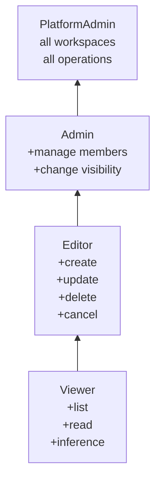

The authoritative reference for NeMo Platform roles and their permissions. For background on how RBAC works, see [Authorization Concepts](/documentation/access-control/concepts). For managing workspace members, see [Managing Access](/documentation/access-control/authorization/managing-access).

## Role Descriptions

NeMo Platform provides human-facing roles for interactive users and a separate workload role for job runtime identities:

**Viewer** — For stakeholders who need visibility into resources but should not modify them.

- View all resources in a workspace (models, datasets, jobs, evaluations)
- Run inference on deployed models
- View job logs and evaluation results
- Cannot create, update, or delete any resources

**Editor** — For team members who actively work with resources.

- All Viewer permissions
- Create, update, and delete resources (models, datasets, evaluations, jobs)
- Run customization jobs, evaluations, and data design tasks
- Cannot manage workspace members or settings

**Admin** — For workspace owners who manage their team's access.

- All Editor permissions
- Add and remove workspace members
- Change member roles
- Grant wildcard access (`*`) to the workspace
- Change workspace visibility

**PlatformAdmin** — For platform operators who manage the entire NeMo Platform deployment. This role bypasses all workspace-level authorization.

- All Admin permissions across every workspace
- Access all workspaces regardless of role bindings
- Manage platform-level configuration
- Create and delete any workspace

**JobRunner** — For workload identities used by running jobs, not interactive users.

- Upload job logs produced by workload containers
- Does not include Viewer, Editor, or Admin permissions
- Should be granted alongside the minimum human-facing role the workload needs, such as Viewer when the workload only reads workspace resources

## Role Hierarchy

The human-facing roles include all permissions of the roles below them. JobRunner is intentionally outside this hierarchy.

## Permission Matrix

Rows are operations; columns are human-facing roles. Read the hierarchy above first: each role inherits everything below it, and the tables call out the points where additional privileges appear. See [Permissions Reference](/documentation/access-control/authorization/permissions-reference) for workload-role permissions such as JobRunner.

### Workspace Operations

| Operation | Viewer | Editor | Admin | PlatformAdmin |
|-----------|:------:|:------:|:-----:|:-------------:|
| List workspaces (visible to user) | ✓ | ✓ | ✓ | ✓ |
| Delete workspace | | | ✓ | ✓ |
| List workspace members | ✓ | ✓ | ✓ | ✓ |
| Add / remove members | | | ✓ | ✓ |
| Change workspace visibility | | | ✓ | ✓ |

<Note>

Workspace creation is controlled by the `WorkspaceCreator` permission in the `system` workspace rather than by the workspace roles in the table above. By default, platform seed grants `WorkspaceCreator` to the wildcard principal `*`, so all authenticated users can still create workspaces until operators change that binding. The creator automatically becomes Admin.

</Note>
### Resource Operations (Models, Datasets, Projects)

| Operation | Viewer | Editor | Admin | PlatformAdmin |
|-----------|:------:|:------:|:-----:|:-------------:|
| List resources | ✓ | ✓ | ✓ | ✓ |
| View / read resource | ✓ | ✓ | ✓ | ✓ |
| Create resource | | ✓ | ✓ | ✓ |
| Update resource | | ✓ | ✓ | ✓ |
| Delete resource | | ✓ | ✓ | ✓ |

### Jobs (Customization, Evaluation, Data Design)

| Operation | Viewer | Editor | Admin | PlatformAdmin |
|-----------|:------:|:------:|:-----:|:-------------:|
| List jobs | ✓ | ✓ | ✓ | ✓ |
| View job / logs | ✓ | ✓ | ✓ | ✓ |
| Create / run job | | ✓ | ✓ | ✓ |
| Cancel job | | ✓ | ✓ | ✓ |
| Delete job | | ✓ | ✓ | ✓ |

<Note>

JobRunner can upload logs from workload containers but does not grant job creation, job management, or workspace read access by itself.

</Note>

### Inference

| Operation | Viewer | Editor | Admin | PlatformAdmin |
|-----------|:------:|:------:|:-----:|:-------------:|
| Run inference (chat completions, completions, embeddings) | ✓ | ✓ | ✓ | ✓ |

### Deployment

| Operation | Viewer | Editor | Admin | PlatformAdmin |
|-----------|:------:|:------:|:-----:|:-------------:|
| List deployments | ✓ | ✓ | ✓ | ✓ |
| View deployment | ✓ | ✓ | ✓ | ✓ |
| Create deployment | | ✓ | ✓ | ✓ |
| Update deployment | | ✓ | ✓ | ✓ |
| Delete deployment | | ✓ | ✓ | ✓ |

## Wildcard Principal Behavior

The wildcard principal `*` grants a role to **all authenticated users**. When both a wildcard binding and an explicit binding exist for a user in the same workspace, the highest role wins.

Example:

- Workspace `shared-data` has `*` → Viewer
- `alice@company.com` has explicit Editor binding in `shared-data`
- Alice's effective role: **Editor** (highest of Viewer and Editor)

## Default Workspace Bindings

NeMo Platform automatically provisions wildcard bindings on built-in workspaces:

| Workspace | Wildcard Role | Effect |
|-----------|--------------|--------|
| `default` | Editor for `*` | All authenticated users can create and manage resources |
| `system` | Viewer for `*` | All authenticated users have read-only access to system resources |
| `system` | WorkspaceCreator for `*` | All authenticated users can create workspaces until operators rebind the role |

## Admin Protection

Every workspace must have at least one Admin. The platform enforces this:

- You cannot remove the last Admin from a workspace
- You cannot change the last Admin's role to Viewer or Editor

To leave a workspace where you are the only Admin, add another Admin first.

## Related

- [Authorization Concepts](/documentation/access-control/concepts) — Workspaces, roles, bindings, and the RBAC model.
- [Managing Access](/documentation/access-control/authorization/managing-access) — Add users, assign roles, manage workspace members.
- [API Scopes](/documentation/access-control/authorization/api-scopes) — Token-level scope restrictions.
- [Security Model](/documentation/access-control/security-model) — Trust boundaries and authorization layers.
