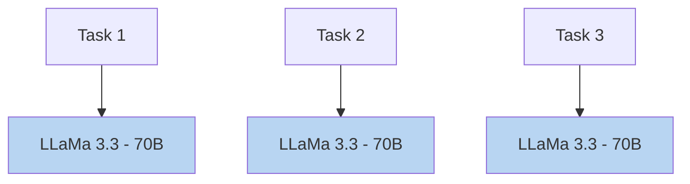
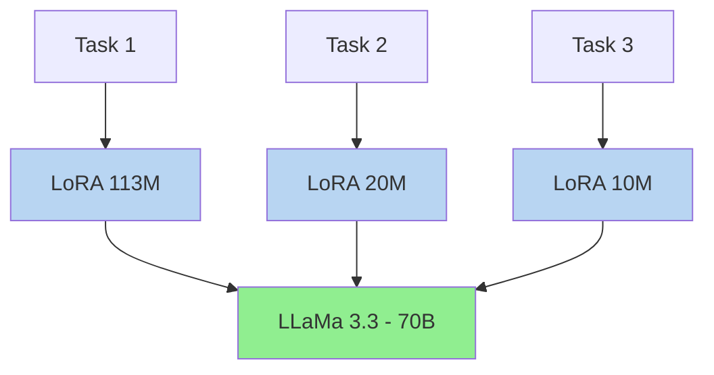
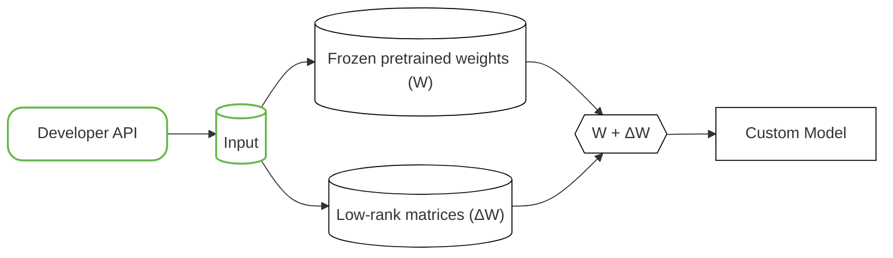

<a id="nemo-ms-about-concepts-customization"></a>

This page provides an overview of the customization concepts for the NeMo Platform.

## Supervised Fine-Tuning

Supervised fine-tuning (SFT) is a traditional technique for customizing a pre-trained model on labeled datasets for a specific task. It enhances the model's performance on the task by updating the model's weights. This traditional SFT technique trains and stores the entire model, which can be memory-intensive and time-consuming.

### Deploying Full SFT Models

Full SFT models require a NIM deployment to serve inference. The Deployment Management Service supports two deployment modes:

| Deployment Mode | Image Type | Weight Loading | Best For |
|-----------------|------------|----------------|----------|
| **Multi-LLM** (Default) | Generic multi-model NIM | On-the-fly download via Files service | Any HF model, custom fine-tuned models, development |
| **Model-Specific NIM** | Dedicated model image | Pre-download via model puller | Production, optimized performance and latency |

- **Multi-LLM Image**: Can deploy any HuggingFace-compatible model, providing maximum flexibility for custom fine-tuned models. Does not guarantee optimized inference performance.

- **Model-Specific NIM**: Provides optimized inference performance and latency through model-specific optimizations. Recommended for production deployments where performance is critical.

## Parameter-Efficient Fine-Tuning

Parameter-Efficient Fine-Tuning (PEFT) methods enable efficient model customization by training a small number of parameters while keeping the base model frozen. For example, when customizing LLaMa 3.3 70B:

- **Traditional SFT**: Trains and stores ~40 GB per task.
- **PEFT**: Trains and stores only a few MB per task while maintaining comparable performance.





NeMo Customizer supports supervised fine-tuning (SFT) with the PEFT method of Low-Rank Adaptation (LoRA).

Fine-tuning with LoRA is the recommended starting point for most use cases.

<a id="nemo-ms-about-concepts-customization-lora"></a>
## LoRA

In comparison to full fine-tuning of a base model, Low-Rank Adaptation (LoRA) has the following advantages:

- Updates only a small portion of the base model's weights
- Comparable performance to full fine-tuning of a base model
- LoRA is more memory and storage efficient than full fine-tuning

LoRA high level architecture:



During LoRA training:

1. The original model's pretrained weights (W) remain frozen
2. Small, trainable low-rank matrices are added to approximate weight updates (ΔW)
3. These updates are applied to the query and value matrices in the model's attention layers
4. The final model combines the original weights with these updates (W + ΔW)

This approach:

- Requires training only a fraction of the parameters
- Maintains model quality comparable to full fine-tuning
- Reduces memory usage and training time
- Adds minimal latency during inference

Additional Resources:

- [What is LoRA?](https://developer.nvidia.com/blog/tune-and-deploy-lora-llms-with-nvidia-tensorrt-llm/#what_is_lora)
- [LoRA: Low-Rank Adaptation of Large Language Models](https://arxiv.org/pdf/2106.09685)
- [Hands on example of using NeMo framework to apply LoRA](https://github.com/NVIDIA-NeMo/NeMo/blob/v2.5.3/tutorials/nlp/lora.ipynb)

## Training with Your Own Data

Use NeMo Customizer to train custom models on your own data. The workflow can be carried out as follows:
- Upload a dataset
- Train a custom model
- Perform inference with the trained model

### Truncating Long Dataset Samples

Long samples in the dataset are truncated during training if the total token length exceeds the context supported by the model.

<Note>

Refer to the model's documentation to see the maximum supported sequence length.

</Note>
| Dataset Type | Token Counting | Length Management |
|--------------|----------------|-------------------|
| Prompt Completion | • Total = prompt + completion tokens | • Truncates prompt tokens to fit limits<br />• Filters out entries that still exceed maximum length |
| Conversational | • Total = conversation turns + template tokens<br />• Templates are model-specific | • Truncates tokens beyond maximum limit<br />• Preserves template formatting |

### Prompt Completion Datasets

Below are some examples of how you might format your dataset to perform a handful of different tasks.

<Note>

When testing models trained with prompt/completion datasets, use the `/v1/completions` endpoint instead of `/v1/chat/completions`.

For details, refer to the [Dataset Formatting tutorial](/documentation/fine-tune-models/tutorials/format-training-dataset#format-a-prompt-completion-dataset).

</Note>
#### Document Classification

Classify a document into predefined categories. Each training example consists of:

- A document to classify
- Its corresponding class label

Format:

```text
prompt: "Classify this document into one of the following classes: [class label 1, class label 2, class label 3]. Only specify one label per document.\n\n<document>\nClass: "
completion: "<class label>"
```

#### Extractive Q&A

Extract an answer from a given context in response to a question. Each training example consists of:

- A question to answer
- A context passage containing the answer
- The extracted answer

Format:

```text
prompt: "<Question> context: <context> answer: "
completion: "<Answer>"
```

#### Simplification

Simplify complex text into a clearer version. Each training example consists of:

- A complex sentence or paragraph
- Its simplified version

Format:

```text
prompt: "Simplify the following sentence:\n<complex>\nsimple: "
completion: "<simple>"
```

### Conversational Datasets

Most of the models support Instruction Templates for training, the expected dataset conforms with the standard [OpenAI messages format](https://platform.openai.com/docs/guides/fine-tuning#multi-turn-chat-examples). Additionally, some models support tool calling which have additional optional parameters of `tools` at the top level of each entry and `tool_calls` per message.

For more information refer to our [in-depth instructions](/documentation/fine-tune-models/tutorials/format-training-dataset#format-a-conversation-dataset).

## Hyperparameters

Hyperparameters are configuration settings used to control the training process. You'll set these values before training begins to optimize how the model learns from your data. While the model automatically learns its internal parameters during training, these hyperparameters help guide that learning process. The right values depend on your specific use case, dataset size, and computational resources.

| Hyperparameter | Description | Default |
|----------------|-------------|---------|
| `epochs` | Number of complete passes through the training dataset | Model-dependent |
| `batch_size` | Number of samples processed before updating model weights | Model-dependent |
| `learning_rate` | Step size for weight updates during training | Model-dependent |
| `training.type` | Training type: `"sft"` for supervised fine-tuning | `"sft"` |
| `training.peft.type` | PEFT method: `"lora"` for Low-Rank Adaptation | — |
| `training.peft.rank` | LoRA rank (lower = fewer parameters, higher = more expressive) | 8 |
| `training.peft.alpha` | LoRA scaling factor | 32 |

## Parallelism

NeMo Platform Customizer supports various distributed training parallelization methods, which can be mixed together.

### Tensor Parallelism

[Tensor Parallelism](https://docs.nvidia.com/nemo-framework/user-guide/latest/nemotoolkit/features/parallelisms.html#tensor-parallelism) (TP) distributes the parameter tensor of an individual layer across GPUs. In addition to reducing model state memory usage, it also saves activation memory as the per-GPU tensor sizes shrink. The tradeoff is increased CPU overhead.

TP can be configured via `parallelism.tensor_parallel_size` in the [training configuration](/documentation/customizer-reference/manage-jobs/training-configuration).

<Note>

As of release 25.10.0, AutoModel engines including Phi-4, Qwen, and Gemma support tensor parallelism greater than 1 through the multi-GPU LoRA patch. Previous releases only supported `TP=1` for these models.

</Note>
### Pipeline Parallelism

[Pipeline Parallelism](https://docs.nvidia.com/nemo-framework/user-guide/latest/nemotoolkit/features/parallelisms.html#pipeline-parallelism) (PP) distributes the layers of a neural network across GPUs. The GPUs then process the different layers sequentially.

PP can be configured via `parallelism.pipeline_parallel_size` in the [training configuration](/documentation/customizer-reference/manage-jobs/training-configuration).

#### Configuration

- Constraints
 - TP must be less than or equal to the total number of GPUs available. It should be a factor of the total GPU count (divisible evenly).
- Multi-node considerations
 - TP can span across nodes, but this introduces network communication overhead. For multi-node setups, it's often recommended to keep TP within a single node when possible. If using TP across nodes, high-bandwidth inter-node connections (like InfiniBand) become critical.
 
 Example: if you have 2 nodes with 4 GPUs each, start with TP=4 first. This keeps all tensor parallel operations within a single node. If your model still uses too much GPU memory with this setting, increase to TP=8, which will distribute tensor operations across both nodes.
- Performance
 - Smaller TP values generally have less communication overhead.
 - Larger TP values provide more memory savings but increase communication costs.

### Sequence Parallelism

[Sequence Parallelism](https://docs.nvidia.com/nemo-framework/user-guide/latest/nemotoolkit/features/parallelisms.html#sequence-parallelism) (SP) extends tensor-level model parallelism by distributing computing load and activation memory across multiple GPUs along the sequence dimension of transformer layers. This method is particularly useful when training on the datasets with longer sequences. It also benefits portions of the layer that have previously not been parallelized, enhancing overall model performance and efficiency.

Sequence Parallelism can be enabled/disabled using `parallelism.sequence_parallel` in the [training configuration](/documentation/customizer-reference/manage-jobs/training-configuration).

## Sequence Packing

[Sequence packing](https://docs.nvidia.com/nemo-framework/user-guide/latest/sft_peft/packed_sequence.html) is an efficient training optimization that combines multiple training examples into a single, longer sequence (called a pack). By eliminating the need for padding between sequences, this technique helps you:

- Process more tokens in each micro batch
- Maximize GPU compute efficiency
- Optimize GPU memory usage

When enabled, the `batch_size` and number of training steps update so that each gradient iteration sees, on average, the same number of tokens compared to running fine-tuning _without_ sequence packing.

### Limitations

- Sequence packing is an experimental feature only supprted by the following models:
 - meta/llama-3.1-8b-instruct
 - meta/llama-3.1-70b-instruct
 - meta/llama3-70b-instruct
 - meta/llama-3.2-3b-instruct
 - meta/llama-3.2-1b
 - meta/llama-3.2-1b-instruct

- Chat prompt templates do not have support for sequence packing.

<Note>

If `training.sequence_packing` is enabled when using a model that does not support sequence packing, the fine-tuning will proceed _without_ sequence packing and a warning will be returned in the API response.

</Note>
### Example of using in the API

Example of creating a customization job with sequence packing enabled:

```python
job = client.customization.jobs.create(
    workspace="default",
    name="my-packed-job",
    spec={
        "model": "default/llama-3.1-8b-instruct",
        "dataset": "fileset://default/test-dataset",
        "training": {
            "type": "sft",
            "peft": {"type": "lora", "rank": 16},
            "sequence_packing": True,
            "epochs": 10,
            "batch_size": 16,
            "learning_rate": 0.00001,
        },
    },
)
```

Learn how to create a LoRA customization job with sequence packing by following the [Optimizing for Tokens/GPU](tutorials/optimize-throughput.ipynb) tutorial.
