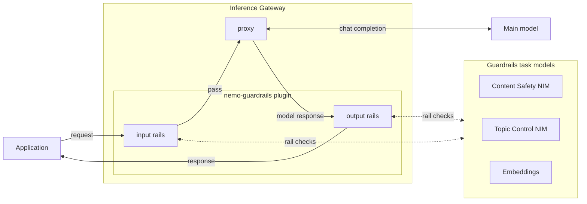

<a id="nemo-ms-guardrails-architecture"></a>

NeMo Guardrails runs as an Inference Gateway (IGW) middleware plugin that intercepts inference requests and responses to apply configurable safety checks. Rather than routing traffic through a separate service, guardrails execute in-process on IGW as part of the VirtualModel middleware pipeline.

## How Guardrails Integrates with Inference

NeMo Guardrails is wired into the inference pipeline through **VirtualModels**. A VirtualModel is a logical inference route that maps a user-facing model name to a backend model and defines ordered middleware pipelines for request and response processing.

When you create a VirtualModel with `nemo-guardrails` middleware entries, every inference request to that VirtualModel flows through the guardrails pipeline automatically:

1. **Your application** sends a chat completion request to the standard IGW OpenAI-compatible endpoint, specifying the VirtualModel as the `model`.
2. **IGW** resolves the VirtualModel and runs its **request middleware** chain. The `nemo-guardrails` plugin executes **input rails** (content safety, topic control, self-check, etc.) against the user's messages.
3. If input rails **block** the request, the plugin returns a refusal immediately — the main model is never called.
4. If input rails **pass**, IGW **proxies** the request to the backend model (specified by the VirtualModel's `default_model_entity`).
5. After the model responds, IGW runs the **response middleware** chain. The `nemo-guardrails` plugin executes **output rails** against the model's response.
6. If output rails **block**, the response is replaced with a refusal. Otherwise, the original model response is returned to your application.



<Note>

`self-check` rails reuse the main model that IGW resolved from the VirtualModel's `default_model_entity`, so no extra model deployment is needed.

</Note>
A single IGW instance can serve multiple VirtualModels, each with different guardrail configurations and backend models. Task models (content safety, topic control, embeddings) are declared in the guardrail configuration and resolved through IGW's model routing. The main model is owned by IGW and comes from the VirtualModel's `default_model_entity` — guardrail configurations typically omit it.

---

## VirtualModel Middleware Wiring

Guardrails are activated by adding `nemo-guardrails` middleware entries to a VirtualModel's `request_middleware` and/or `response_middleware` lists. Each middleware entry specifies:

- `name`: `"nemo-guardrails"` — the plugin identifier.
- `config_type`: `"guardrail_config"` — the config schema discriminator.
- `config_id` or `config`: The guardrail configuration to apply, either as an entity reference (`"workspace/config-name"`) or an inline payload.

```bash
nemo inference virtual-models create my-guarded-model \
  --default-model-entity default/meta-llama-3-1-8b-instruct \
  --request-middleware '[{"name":"nemo-guardrails","config_type":"guardrail_config","config_id":"default/my-config"}]' \
  --response-middleware '[{"name":"nemo-guardrails","config_type":"guardrail_config","config_id":"default/my-config"}]'
```

Wire the same config on both `request_middleware` (for input rails) and `response_middleware` (for output rails). If your config only defines input flows, you can omit `response_middleware` — the plugin skips output processing when no output flows are configured, and vice versa. See [Running Inference](/documentation/guardrail-models/core-concepts/running-inference) for the equivalent Python SDK call and a fuller end-to-end example.

---

## Config Resolution

The plugin resolves guardrail configurations in two ways:

| Method | MiddlewareCall field | When to use |
|--------|---------------------|-------------|
| **Entity-backed** | `config_id: "workspace/config-name"` | Production. Config is stored as a GuardrailConfig entity and resolved at VirtualModel cache time. |
| **Inline** | `config: { ... rails payload ... }` | Development and testing. Config is embedded directly in the VirtualModel spec. |

Both paths flow through the same execution pipeline and share the same content-hash pool inside the plugin's cache. An inline config that is structurally identical to an entity-backed one reuses the same cached resources.

---

## Model Routing

NeMo Guardrails uses IGW's model routing for all model calls:

- **Main model**: Owned by IGW. The VirtualModel's `default_model_entity` sets the model used for generation. Your guardrail configuration should omit the `type: "main"` model entry — IGW injects the per-request main model at runtime.
- **Task models**: Declared in the guardrail configuration (e.g., `content_safety`, `topic_control`, `self_check_input`). The plugin resolves each task model's `base_url` through IGW's route table using the model's entity reference (`workspace/name` format).

For more details on model entities and providers, refer to [About Models and Inference](/documentation/models-and-inference).

---

## Caching and Performance

The plugin caches `LLMRails` instances (the NeMo Guardrails runtime) by content hash. Configurations with identical rails, prompts, and task models share the same cache entry regardless of whether they were resolved from an entity or inline. Key behaviors:

- **Warm on VirtualModel upsert**: When a VirtualModel referencing the plugin is created or updated, the plugin pre-builds `LLMRails` instances in the background so the first request avoids cold-start latency. Warming is fire-and-forget — if a request arrives before warming completes, the request lazily builds the cache entry itself and pays the cold-start cost.
- **Per-request main model injection**: The main model is built per request and injected into the cached `LLMRails` instance, so different VirtualModels sharing the same guardrail config but targeting different main models reuse the same cache entry.
- **LRU eviction**: The cache is bounded with LRU eviction. In-flight requests pin their cache entry against eviction.

---

## Next Steps

- [Guardrail Configurations](/documentation/guardrail-models/core-concepts/configurations) — Define guardrail configurations (models, prompts, rails).
- [Running Inference](/documentation/guardrail-models/core-concepts/running-inference) — Make inference calls through a guarded VirtualModel.
- [Deploy NemoGuard NIMs](/documentation/guardrail-models/tutorials/deploy-nemo-guard-ni-ms) — Deploy NemoGuard NIMs for content safety and topic control.
