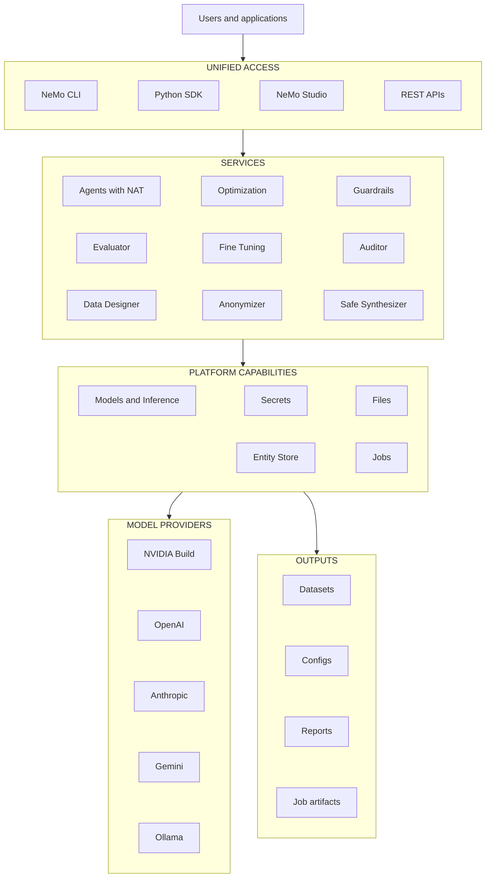

Make the agents you ship faster, more accurate, and safer.

NeMo Platform brings NVIDIA NeMo libraries together under one CLI, Python SDK, and web UI. Hardening, evaluation, and tuning for the agents you put in production.

## Architecture

NeMo Platform exposes the same local services through the CLI, Python SDK, Studio, and REST APIs. First-party capabilities share platform infrastructure for inference, credentials, files, entities, and job execution.

## What You Can Do

- **Secure agents.** Guardrails (content safety, jailbreak detection, PII redaction), Auditor (red-teaming via garak), Anonymizer (PII handling for training data).
- **Evaluate agents.** LLM-as-judge, deterministic, agentic, and RAG benchmarks. Harbor-backed eval suites for regression testing.
- **Tune agents.** Skill optimization, prompt and hyperparameter tuning, Switchyard model routing.
- **Build agents.** NVIDIA NeMo Agent Toolkit (NAT) for LangGraph-based agents. Shared infrastructure: Inference Gateway, Secrets, Files, Entity Store, Jobs.
- **Generate synthetic data.** Generate synthetic data for training or evaluation purposes using Data Designer.
- **NeMo Studio (alpha).** Installed automatically with the platform. Studio is a browser UI for chatting with agents and models, starting and monitoring various jobs, and reviewing results. Studio's agent-focused features are still a work in progress; the CLI is the primary surface today.

## Platform Capabilities

The platform provides several shared capabilities to NeMo libraries.

- [Models and Inference](/documentation/models-and-inference) for model providers, virtual
  models, and gateway calls.
- [Files](/documentation/get-started/core-concepts/manage-files), [Secrets](/documentation/get-started/core-concepts/manage-secrets),
  [Entities](/documentation/get-started/core-concepts/entities), and jobs for storing state and
  running local work.

## Architecture Diagram

## Where to Go Next

- [Setup](/documentation/get-started) - install, configure providers, and run
  local services.
- [About Agents](/documentation/agents) - learn the managed agent lifecycle.
- [Optimize Agents](/documentation/agents/optimize-agents) - improve cost, quality, and model
  routing.
- [Secure Agents](/documentation/agents/secure-agents) - harden agents with guardrails and data
  safety checks.
