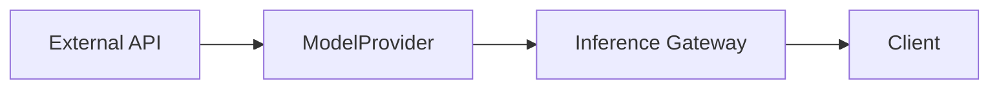
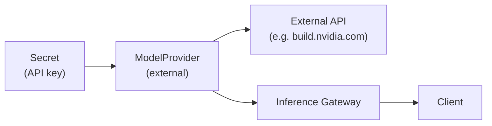

<a id="run-inference-about"></a>

The NeMo Platform provides APIs for registering external model providers and routing inference requests through a unified gateway.



---

## Model Registry

Models service manages model entities and model providers.

### Core Objects

**Model** — A registered model within the platform, referencing a specific model like `nvidia/NVIDIA-Nemotron-3-Nano-30B-A3B-BF16`. Models are made available by a hosted provider (NVIDIA Build, OpenAI, and so on) and are served via a **ModelProvider**.

**ModelProvider** — A routable inference host registered for an external API (NVIDIA Build, OpenAI, and so on). All inference requests route through a ModelProvider which serves one or more **Models**.

---

## Model Providers

Model providers connect the platform to external inference APIs such as [NVIDIA Build](https://build.nvidia.com/) or OpenAI. The workflow is:

1. **Store the API key** as a [secret](/documentation/get-started/core-concepts/manage-secrets) in the platform
2. **Create a model provider** pointing to the external API with the secret reference
3. **Route inference** through the gateway using provider or model entity routing



<Markdown src="/snippets/_snippets/nvidia-build-model-provider.mdx" />
<a id="add-external-providers"></a>

### Add External Providers

Register external inference APIs like NVIDIA Build or OpenAI.

#### NVIDIA Build

By default, the platform pre-configures an external provider for NVIDIA Build named `nvidia-build` in the `system` workspace.
The example below demonstrates how to recreate it in your own workspace.
For disambiguation purposes, this example names the manually-created version `my-nvidia-build`.


<Tabs>

<Tab title="CLI">

```bash
# Store API key
echo "$NVIDIA_API_KEY" | nemo secrets create "nvidia-api-key" --from-file -

# Create provider
nemo inference providers create "my-nvidia-build" \
    --host-url "https://integrate.api.nvidia.com" \
    --api-key-secret-name "nvidia-api-key"

nemo wait inference provider my-nvidia-build

# Test using interactive chat
nemo chat nvidia/llama-3.3-nemotron-super-49b-v1 'Hello!' \
    --provider my-nvidia-build
```

</Tab>
<Tab title="Python SDK">

```python
# Store API key
client.secrets.create(name="nvidia-api-key", data=os.environ["NVIDIA_API_KEY"])

# Create provider
provider = client.inference.providers.create(
    name="my-nvidia-build",
    host_url="https://integrate.api.nvidia.com",
    api_key_secret_name="nvidia-api-key",
)

client.models.wait_for_provider("my-nvidia-build")

# Use provider routing
response = client.inference.gateway.provider.post(
    "v1/chat/completions",
    name="my-nvidia-build",
    body={
        "model": "meta/llama-3.1-8b-instruct",
        "messages": [{"role": "user", "content": "Hello!"}],
        "max_tokens": 100,
    },
)
```

</Tab>

</Tabs>
#### OpenAI


<Tabs>

<Tab title="CLI">

```bash
# Store API key
echo "$OPENAI_API_KEY" | nemo secrets create "openai-api-key" --from-file -

# Create provider with enabled models
nemo inference providers create "openai" \
    --host-url "https://api.openai.com/v1" \
    --api-key-secret-name "openai-api-key" \
    --enabled-models "gpt-4" \
    --enabled-models "gpt-3.5-turbo"

nemo wait inference provider openai

# Test using interactive chat
nemo chat gpt-4 'Hello!' \
    --provider openai
```

</Tab>
<Tab title="Python SDK">

```python
client.secrets.create(name="openai-api-key", data=os.environ["OPENAI_API_KEY"])

provider = client.inference.providers.create(
    name="openai",
    host_url="https://api.openai.com/v1",
    api_key_secret_name="openai-api-key",
    enabled_models=["gpt-4", "gpt-3.5-turbo"],
)

client.models.wait_for_provider("openai")

# Use provider routing
response = client.inference.gateway.provider.post(
    "v1/chat/completions",
    name="openai",
    body={
        "model": "gpt-4",
        "messages": [{"role": "user", "content": "Hello!"}],
        "max_tokens": 100,
    },
)
```

</Tab>

</Tabs>
#### Anthropic

Anthropic's `/v1/messages` API expects the API key in an `X-Api-Key:` header (not `Authorization: Bearer`) and requires an `anthropic-version` header on every request. Use `--auth-header-format` (Jinja2 template, must contain exactly one `{{ auth_secret }}` variable) to override the default `Authorization: Bearer {{ auth_secret }}` and pass the API-version pin via `--default-extra-headers`. Without these, Anthropic rejects every request with 401.

<Tabs>

<Tab title="CLI">

```bash
# Store API key
echo "$ANTHROPIC_API_KEY" | nemo secrets create "anthropic-api-key" --from-file -

# Create provider — override the default Bearer header and pin the API version
nemo inference providers create "anthropic" \
    --host-url "https://api.anthropic.com" \
    --api-key-secret-name "anthropic-api-key" \
    --auth-header-format "X-Api-Key: {{ auth_secret }}" \
    --default-extra-headers '{"anthropic-version": "2023-06-01"}'

nemo wait inference provider anthropic
```

</Tab>
<Tab title="Python SDK">

```python
# Store API key
client.secrets.create(name="anthropic-api-key", data=os.environ["ANTHROPIC_API_KEY"])

# Create provider — override the default Bearer header and pin the API version
provider = client.inference.providers.create(
    name="anthropic",
    host_url="https://api.anthropic.com",
    api_key_secret_name="anthropic-api-key",
    auth_header_format="X-Api-Key: {{ auth_secret }}",
    default_extra_headers={"anthropic-version": "2023-06-01"},
)

client.models.wait_for_provider("anthropic")
```

</Tab>

</Tabs>
`{{ auth_secret }}` is substituted with the resolved secret value at request time.

---

## Inference Gateway

Inference Gateway is a Layer 7 reverse proxy providing unified access to all inference endpoints. It supports three routing patterns:

### Routing Patterns

| Pattern | Endpoint | Use Case |
|---------|----------|----------|
| Model Entity | `/apis/inference-gateway/v2/workspaces/{ws}/model/{name}/-/*` | Route by model name |
| Provider | `/apis/inference-gateway/v2/workspaces/{ws}/provider/{name}/-/*` | Route to specific provider (A/B testing) |
| OpenAI | `/apis/inference-gateway/v2/workspaces/{ws}/openai/-/*` | OpenAI SDK compatibility (model in body) |

All patterns use `/-/` as a separator. Everything after `/-/` is forwarded to the backend unchanged.

### Path Examples

```text
# Model entity routing
/apis/inference-gateway/v2/workspaces/default/model/llama-3-2-1b/-/v1/chat/completions

# Provider routing
/apis/inference-gateway/v2/workspaces/default/provider/my-provider/-/v1/chat/completions

# OpenAI routing (model specified in request body as "workspace/model-entity")
/apis/inference-gateway/v2/workspaces/default/openai/-/v1/chat/completions
```

Use `nemo inference get-url` to print the correct base URL for your workspace
without hand-assembling the path. Add `--provider <name>` or
`--virtual-model <name>` to get the URL for the corresponding proxy route.

### SDK Helper Methods

Set up the CLI or Python SDK first:

<Markdown src="/snippets/_snippets/tutorials/cli-sdk-setup.mdx" />
The SDK provides convenience methods for OpenAI compatibility:

```python
# Get pre-configured OpenAI client
model_name = "my-model"
provider_name = "my-provider"
workspace = "default"
oai_client = client.models.get_openai_client()


# Get base URLs for different routing patterns
client.models.get_openai_route_base_url()

entity = client.models.retrieve(model_name, workspace=workspace)
entity_url = client.models.get_model_entity_route_openai_url(entity)
print(entity_url)

provider = client.inference.providers.retrieve(provider_name, workspace=workspace)
provider_url = client.models.get_provider_route_openai_url(provider)
print(provider_url)
```

---

## Verifying Gateway Reachability

The platform exposes two health endpoints at the root of the platform router.
The inference gateway is reachable through the same platform host, so these are
the canonical checks for "is the gateway up?":

| Endpoint | Purpose |
|---|---|
| `GET {NMP_BASE_URL}/health/ready` | Readiness — returns 200 once dependent services are up |
| `GET {NMP_BASE_URL}/health/live` | Liveness |

```bash
curl -s http://localhost:8080/health/ready
```

`/v1/health/ready` and `/v1/health/live` are **NIM** endpoints, not gateway
endpoints. If a probe at `/v1/health/...` against the gateway returns 404 it's
working as designed — use `/health/ready` instead.

---

## API Reference

For complete API details, refer to the [Inference Gateway API Reference](/documentation/reference/api-reference) and [SDK Reference](/documentation/reference/python-sdk).
