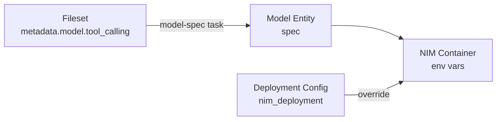

<a id="tutorial-deploy-models"></a>

Deploy models from NGC or HuggingFace. Register external providers like OpenAI or NVIDIA Build.

<Note>

Resource names for deployments, deployment configs, and providers must contain only letters (a-z, A-Z), digits (0-9), underscores, hyphens, and dots. For example: `llama-3.1-8b`, `my-custom-model`, `qwen-fs-config`.

</Note>

<Markdown src="/snippets/_snippets/tutorials/cli-sdk-setup.mdx" />
---

## Add External Providers

Register external inference APIs like NVIDIA Build or OpenAI.

### NVIDIA Build

By default, the platform pre-configures an external provider for NVIDIA Build named `nvidia-build` in the `system` workspace.
The example below demonstrates how to recreate it in your own workspace.
For disambiguation purposes, this example names the manually-created version `my-nvidia-build`.


<Tabs>

<Tab title="CLI">

```bash
# Store API key
echo "$NVIDIA_API_KEY" | nemo secrets create "nvidia-api-key" --from-file -

# Create provider
nemo inference providers create "my-nvidia-build" \
--host-url "https://integrate.api.nvidia.com" \
--api-key-secret-name "nvidia-api-key"

nemo wait inference provider my-nvidia-build

# Test using interactive chat
nemo chat nvidia/llama-3.3-nemotron-super-49b-v1 'Hello!' \
--provider my-nvidia-build
```

</Tab>
<Tab title="Python SDK">

```python
# Store API key
client.secrets.create(name="nvidia-api-key", value=os.environ["NVIDIA_API_KEY"])

# Create provider
provider = client.inference.providers.create(
    name="my-nvidia-build",
    host_url="https://integrate.api.nvidia.com",
    api_key_secret_name="nvidia-api-key",
)

client.models.wait_for_provider("my-nvidia-build")

# Use provider routing
response = client.inference.gateway.provider.post(
    "v1/chat/completions",
    name="my-nvidia-build",
    body={
        "model": "meta/llama-3.1-8b-instruct",
        "messages": [{"role": "user", "content": "Hello!"}],
        "max_tokens": 100,
    },
)
```

</Tab>

</Tabs>
### OpenAI


<Tabs>

<Tab title="CLI">

```bash
# Store API key
echo "$OPENAI_API_KEY" | nemo secrets create "openai-api-key" --from-file -

# Create provider with enabled models
nemo inference providers create "openai" \
--host-url "https://api.openai.com/v1" \
--api-key-secret-name "openai-api-key" \
--enabled-models "gpt-4" \
--enabled-models "gpt-3.5-turbo"

nemo wait inference provider openai

# Test using interactive chat
nemo chat gpt-4 'Hello!' \
--provider openai
```

</Tab>
<Tab title="Python SDK">

```python
client.secrets.create(name="openai-api-key", value=os.environ["OPENAI_API_KEY"])

provider = client.inference.providers.create(
    name="openai",
    host_url="https://api.openai.com/v1",
    api_key_secret_name="openai-api-key",
    enabled_models=["gpt-4", "gpt-3.5-turbo"],
)

client.models.wait_for_provider("openai")

# Use provider routing
response = client.inference.gateway.provider.post(
    "v1/chat/completions",
    name="openai",
    body={
        "model": "gpt-4",
        "messages": [{"role": "user", "content": "Hello!"}],
        "max_tokens": 100,
    },
)
```

</Tab>

</Tabs>
### Anthropic

Anthropic's `/v1/messages` API expects the API key in an `X-Api-Key:` header (not `Authorization: Bearer`) and requires an `anthropic-version` header on every request. Use `--auth-header-format` (Jinja2 template, must contain exactly one `{{ auth_secret }}` variable) to override the default `Authorization: Bearer {{ auth_secret }}` and pass the API-version pin via `--default-extra-headers`. Without these, Anthropic rejects every request with 401.

<Tabs>

<Tab title="CLI">

```bash
# Store API key
echo "$ANTHROPIC_API_KEY" | nemo secrets create "anthropic-api-key" --from-file -

# Create provider — override the default Bearer header and pin the API version
nemo inference providers create "anthropic" \
--host-url "https://api.anthropic.com" \
--api-key-secret-name "anthropic-api-key" \
--auth-header-format "X-Api-Key: {{ auth_secret }}" \
--default-extra-headers '{"anthropic-version": "2023-06-01"}'

nemo wait inference provider anthropic
```

</Tab>
<Tab title="Python SDK">

```python
# Store API key
client.secrets.create(name="anthropic-api-key", data=os.environ["ANTHROPIC_API_KEY"])

# Create provider — override the default Bearer header and pin the API version
provider = client.inference.providers.create(
    name="anthropic",
    host_url="https://api.anthropic.com",
    api_key_secret_name="anthropic-api-key",
    auth_header_format="X-Api-Key: {{ auth_secret }}",
    default_extra_headers={"anthropic-version": "2023-06-01"},
)

client.models.wait_for_provider("anthropic")
```

</Tab>

</Tabs>
`{{ auth_secret }}` is substituted with the resolved secret value at request time.

---

## Deploy from NGC

Deploy pre-built NIM containers from NGC.

### Deploy Llama 3.2 1B


<Tabs>

<Tab title="CLI">

```bash
nemo inference deployment-configs create \
--name "llama-3-2-1b-config" \
--nim-deployment '{
"gpu": 1,
"image_name": "nvcr.io/nim/meta/llama-3.2-1b-instruct",
"image_tag": "1.8.6",
"model_name": "meta/llama-3.2-1b-instruct"
}'

nemo inference deployments create \
--name "llama-3-2-1b-deployment" \
--config "llama-3-2-1b-config"

nemo wait inference deployment llama-3-2-1b-deployment

nemo chat meta/llama-3.2-1b-instruct 'Hello!' \
--provider llama-3-2-1b-deployment \
--max-tokens 100
```

</Tab>
<Tab title="Python SDK">

```python
config = client.inference.deployment_configs.create(
    name="llama-3-2-1b-config",
    nim_deployment={
        "gpu": 1,
        "image_name": "nvcr.io/nim/meta/llama-3.2-1b-instruct",
        "image_tag": "1.8.6",
        "model_name": "meta/llama-3.2-1b-instruct",
    },
)

deployment = client.inference.deployments.create(
    name="llama-3-2-1b-deployment", config="llama-3-2-1b-config"
)

client.models.wait_for_status(
    deployment_name="llama-3-2-1b-deployment", desired_status="READY"
)

response = client.inference.gateway.provider.post(
    "v1/chat/completions",
    name="llama-3-2-1b-deployment",
    body={
        "model": "meta/llama-3.2-1b-instruct",
        "messages": [{"role": "user", "content": "Hello!"}],
        "max_tokens": 100,
    },
)
```

</Tab>

</Tabs>
### Deploy NemoGuard JailbreakDetect

Deploy classification NIMs like NemoGuard for content safety. Uses the `/v1/classify` endpoint instead of chat completions.


<Tabs>

<Tab title="CLI">

```bash
nemo inference deployment-configs create \
--name "nemoguard-jailbreak-config" \
--nim-deployment '{
"gpu": 1,
"image_name": "nvcr.io/nim/nvidia/nemoguard-jailbreak-detect",
"image_tag": "1.10.1"
}'

nemo inference deployments create \
--name "nemoguard-jailbreak-deployment" \
--config "nemoguard-jailbreak-config"

nemo wait inference deployment nemoguard-jailbreak-deployment

nemo inference gateway provider post v1/classify \
--name "nemoguard-jailbreak-deployment" \
--body '{"input": "Tell me about vacation spots in Hawaii."}'
```

</Tab>
<Tab title="Python SDK">

```python
config = client.inference.deployment_configs.create(
    name="nemoguard-jailbreak-config",
    nim_deployment={
        "gpu": 1,
        "image_name": "nvcr.io/nim/nvidia/nemoguard-jailbreak-detect",
        "image_tag": "1.10.1",
    },
)

deployment = client.inference.deployments.create(
    name="nemoguard-jailbreak-deployment", config="nemoguard-jailbreak-config"
)

client.models.wait_for_status(
    deployment_name="nemoguard-jailbreak-deployment", desired_status="READY"
)

response = client.inference.gateway.provider.post(
    "v1/classify",
    name="nemoguard-jailbreak-deployment",
    body={"input": "Tell me about vacation spots in Hawaii."},
)
```

</Tab>

</Tabs>
---

## Deploy from HuggingFace

<Warning>

HuggingFace deployments use the Multi-LLM NIM (`nvcr.io/nim/nvidia/llm-nim:1.13.1`) by default, which only supports specific model architectures. Check the [supported architectures list](https://docs.nvidia.com/nim/large-language-models/1.13.0/supported-architectures.html) before deploying. If your model architecture is not listed, you will need a model-specific NIM image — see [Deploy from NGC](#deploy-from-ngc) for that approach.

</Warning>

You can register a HuggingFace model through the Files service. This creates a fileset that acts as a proxy. The Files service handles authentication and caches the weights on first download, so subsequent deployments start faster.


<Tabs>

<Tab title="CLI">

```bash
# (Optional) Create a HuggingFace token secret for private models.
# Public models like Qwen do not require a token.
echo "$HF_TOKEN" | nemo secrets create "hf-token-secret" --from-file -

# Create a fileset pointing to the HuggingFace model.
# "token_secret" is optional — only needed for private/gated models.
nemo files filesets create "qwen-2-5-1-5b" \
--storage '{
"type": "huggingface",
"repo_id": "Qwen/Qwen2.5-1.5B-Instruct",
"repo_type": "model",
"token_secret": "hf-token-secret"
}'

# Register a model entity referencing the fileset
nemo models create "qwen-2-5-1-5b" \
--fileset "default/qwen-2-5-1-5b"

# Create deployment config pointing to the model entity
nemo inference deployment-configs create "qwen-fs-config" \
--nim-deployment '{
"model_namespace": "default",
"model_name": "qwen-2-5-1-5b",
"gpu": 1
}'

nemo inference deployments create "qwen-fs-deployment" \
--config "qwen-fs-config"

nemo wait inference deployment qwen-fs-deployment

nemo chat default/qwen-2-5-1-5b 'Hello!' \
--provider qwen-fs-deployment \
--max-tokens 100
```

</Tab>
<Tab title="Python SDK">

```python
# (Optional) Create a HuggingFace token secret for private models.
# Public models like Qwen do not require a token.
client.secrets.create(name="hf-token-secret", value=os.environ["HF_TOKEN"])

# Create a fileset pointing to the HuggingFace model.
# "token_secret" is optional — only needed for private/gated models.
client.files.filesets.create(
    name="qwen-2-5-1-5b",
    storage={
        "type": "huggingface",
        "repo_id": "Qwen/Qwen2.5-1.5B-Instruct",
        "repo_type": "model",
        "token_secret": "hf-token-secret",
    },
)

# Register a model entity referencing the fileset
client.models.create(name="qwen-2-5-1-5b", fileset="default/qwen-2-5-1-5b")

# Create deployment config pointing to the model entity
config = client.inference.deployment_configs.create(
    name="qwen-fs-config",
    nim_deployment={
        "model_namespace": "default",
        "model_name": "qwen-2-5-1-5b",
        "gpu": 1,
    },
)

# Deploy — no hf_token_secret_name needed
deployment = client.inference.deployments.create(
    name="qwen-fs-deployment", config="qwen-fs-config"
)

client.models.wait_for_status(
    deployment_name="qwen-fs-deployment", desired_status="READY"
)

response = client.inference.gateway.provider.post(
    "v1/chat/completions",
    name="qwen-fs-deployment",
    body={
        "model": "default/qwen-2-5-1-5b",
        "messages": [{"role": "user", "content": "Hello!"}],
        "max_tokens": 100,
    },
)
```

</Tab>

</Tabs>
<Tip>

The `fileset` format is `<workspace>/<fileset-name>`. This tells the deployment system to pull weights from the Files service, which proxies the download from HuggingFace using the fileset `token_secret`. For public models like Qwen, the `token_secret` on the fileset is optional.

</Tip>
---

<a id="nemo-ms-delete-nim"></a>
## Deployment Cleanup


<Tabs>

<Tab title="CLI">

```bash
# Note: Deleting the deployment will free up its GPU(s) when complete
nemo inference deployments delete <deployment-name>
nemo wait inference deployment <deployment-name> --status DELETED
nemo inference deployment-configs delete <config-name>

# For external providers
nemo inference providers delete <provider-name>
nemo secrets delete <secret-name>
```

</Tab>
<Tab title="Python SDK">

```python
# Note: Deleting the deployment will free up its GPU(s) when complete
client.inference.deployments.delete(name="<deployment-name>")
client.models.wait_for_status(
    deployment_name="<deployment-name>", desired_status="DELETED"
)
client.inference.deployment_configs.delete(name="<config-name>")

# For external providers
client.inference.providers.delete(name="<provider-name>")
client.secrets.delete(name="<secret-name>")
```

</Tab>

</Tabs>
---

## Multi-GPU Deployments

For larger models requiring multiple GPUs, parallelism configuration depends on the NIM type.

### Parallelism Strategies

- **Tensor Parallel (TP)**: Splits model layers across GPUs → best for latency
- **Pipeline Parallel (PP)**: Splits model depth across GPUs → best for throughput
- **Formula**: `gpu` = `tp_size` × `pp_size`

### Model-Specific NIMs

Model-specific NIMs (for example, `nvcr.io/nim/meta/llama-3.1-70b-instruct`) have TP/PP settings derived from manifest profiles in the container. Configure enough GPUs and the NIM selects the appropriate profile automatically.

### Multi-LLM NIM

The multi-LLM NIM (`nvcr.io/nim/nvidia/llm-nim:1.13.1`) requires explicit parallelism configuration via environment variables (`NIM_TENSOR_PARALLEL_SIZE`, `NIM_PIPELINE_PARALLEL_SIZE`). By default, it uses all GPUs for tensor parallelism (TP=gpu, PP=1).

This example deploys [Qwen2.5-14B-Instruct](https://huggingface.co/Qwen/Qwen2.5-14B-Instruct) across 2 GPUs using tensor parallelism.


<Tabs>

<Tab title="CLI">

```bash
# Create a fileset pointing to the HuggingFace model
# Qwen models are public — token_secret is optional
nemo files filesets create \
--name "qwen-2-5-14b" \
--storage '{
"type": "huggingface",
"repo_id": "Qwen/Qwen2.5-14B-Instruct",
"repo_type": "model"
}'

# Register a model entity referencing the fileset
nemo models create \
--name "qwen-2-5-14b" \
--fileset "default/qwen-2-5-14b"

# Create deployment config with 2 GPUs (TP=2 by default)
nemo inference deployment-configs create \
--name "qwen-14b-config" \
--nim-deployment '{
"model_name": "default/qwen-2-5-14b",
"gpu": 2
}'

# Deploy
nemo inference deployments create \
--name "qwen-14b-deployment" \
--config "qwen-14b-config"

nemo wait inference deployment qwen-14b-deployment

nemo chat default/qwen-2-5-14b 'Hello!' \
--max-tokens 100
```

</Tab>
<Tab title="Python SDK">

```python
# Create a fileset pointing to the HuggingFace model
# Qwen models are public — token_secret is optional
client.files.filesets.create(
    name="qwen-2-5-14b",
    storage={
        "type": "huggingface",
        "repo_id": "Qwen/Qwen2.5-14B-Instruct",
        "repo_type": "model",
    },
)

# Register a model entity referencing the fileset
client.models.create(name="qwen-2-5-14b", fileset="default/qwen-2-5-14b")

# Create deployment config with 2 GPUs (TP=2 by default)
config = client.inference.deployment_configs.create(
    name="qwen-14b-config",
    nim_deployment={"model_name": "default/qwen-2-5-14b", "gpu": 2},
)

# Deploy
deployment = client.inference.deployments.create(
    name="qwen-14b-deployment", config="qwen-14b-config"
)

client.models.wait_for_status(
    deployment_name="qwen-14b-deployment", desired_status="READY"
)

response = client.inference.gateway.model.post(
    "v1/chat/completions",
    name="qwen-2-5-14b",
    body={
        "model": "default/qwen-2-5-14b",
        "messages": [{"role": "user", "content": "Hello!"}],
        "max_tokens": 100,
    },
)
# NIM sets NIM_TENSOR_PARALLEL_SIZE=2 automatically
```

</Tab>

</Tabs>
### Custom Parallelism Configuration

For larger models requiring more GPUs, you can configure specific TP/PP splits using `additional_envs`. The formula is: `gpu` = `NIM_TENSOR_PARALLEL_SIZE` × `NIM_PIPELINE_PARALLEL_SIZE`.


<Tabs>

<Tab title="CLI">

```bash
nemo inference deployment-configs create \
--name "multi-gpu-custom-config" \
--nim-deployment '{
"model_name": "default/qwen-2-5-14b",
"gpu": 4,
"additional_envs": {
"NIM_TENSOR_PARALLEL_SIZE": "2",
"NIM_PIPELINE_PARALLEL_SIZE": "2"
}
}'
```

</Tab>
<Tab title="Python SDK">

```python
config = client.inference.deployment_configs.create(
    name="multi-gpu-custom-config",
    nim_deployment={
        "model_name": "default/qwen-2-5-14b",
        "gpu": 4,
        "additional_envs": {
            "NIM_TENSOR_PARALLEL_SIZE": "2",
            "NIM_PIPELINE_PARALLEL_SIZE": "2",
        },
    },
)
```

</Tab>

</Tabs>
<Tip>

**Choosing Parallelism Strategy**

- **TP=8, PP=1** (default): Lowest latency, best for real-time applications
- **TP=4, PP=2**: Balanced latency and throughput
- **TP=2, PP=4**: Highest throughput, best for batch processing

For custom models, match deployment parallelism to training parallelism for optimal performance.

</Tip>
---

<a id="deploy-models-chat-templates-tool-calling"></a>
## Chat Templates and Tool Calling

Configure custom chat templates and tool calling for NIM deployments. These settings control how the model formats chat messages and handles function/tool calling.

For more information on chat templates, see the [Hugging Face chat templating guide](https://huggingface.co/docs/transformers/en/chat_templating) and the [NeMo chat templates documentation](https://docs.nvidia.com/nemo/rl/latest/design-docs/chat-datasets.html#chat-templates).

<Warning>

**Security consideration:** Chat templates are Jinja2 programs that execute on every inference call. While NIM uses a sandboxed Jinja2 environment (mitigating arbitrary code execution), a malicious or misconfigured template can still alter model behavior — for example, by injecting hidden instructions, rewriting messages, or degrading output quality. Grant chat template permissions only to trusted users, and review templates before deploying to production. See [Inference-Time Backdoors via Chat Templates (IEEE S&P 2026)](https://arxiv.org/abs/2602.04653) for further background.

</Warning>
### Configuration Sources

There are two ways to configure chat templates and tool calling, with deployment-level settings taking highest priority:

| Source | Priority | When to Use |
|--------|----------|-------------|
| **Fileset `metadata.model.tool_calling`** | Base | Set once per model — applies to all deployments using that model |
| **Deployment config (`nim_deployment`)** | Override | Per-deployment overrides — useful for A/B testing or deployment-specific behavior |

When both are set, deployment config values override fileset values.

### How It Works

1. User sets `chat_template`, `tool_call_parser`, `tool_call_plugin`, and/or `auto_tool_choice` on the fileset via `metadata.model.tool_calling`
2. The model-spec background task reads the fileset's `metadata.model.tool_calling` and writes them into the model entity's `spec`
3. At deployment time, the platform reads `model_entity.spec` and any deployment-level overrides to set NIM environment variables



### Option 1: Set via Fileset (Recommended)

Set `chat_template` and tool calling configuration with fileset `metadata.model.tool_calling`. The platform automatically propagates these into the model entity spec when the model-spec background task runs.


<Tabs>

<Tab title="CLI">

```bash

 # Create fileset with chat template and tool calling config via metadata
 nemo files filesets create \
 --name "llama-3-2-1b-tool" \
 --storage '{
 "type": "huggingface",
 "repo_id": "meta-llama/Llama-3.2-1B-Instruct",
 "repo_type": "model"
 }' \
 --metadata '{
 "model": {
 "tool_calling": {
 "chat_template": "{{ content }}{{ '\''<{{ start_header_id }}>assistant<{{ end_header_id }}>\n\n'\'' }}",
 "tool_call_parser": "llama3_json",
 "auto_tool_choice": true
 }
 }
 }'

 # Register model entity referencing the fileset
 nemo models create \
 --name "llama-3-2-1b-tool" \
 --fileset "default/llama-3-2-1b-tool"

 # Deploy
 nemo inference deployment-configs create \
 --name "llama-tool-config" \
 --nim-deployment '{
 "model_name": "default/llama-3-2-1b-tool",
 "gpu": 1
 }'

 nemo inference deployments create \
 --name "llama-tool-deployment" \
 --config "llama-tool-config"

 nemo wait inference deployment llama-tool-deployment

 ```

</Tab>
<Tab title="Python SDK">

```python

# Create fileset with chat template and tool calling config via metadata
tool_metadata: dict[str, object] = {
    "model": {
        "tool_calling": {
            "chat_template": (
                ""
                ""
                ""
                "{{ content }}"
                "{{ '<{{ start_header_id }}>assistant<{{ end_header_id }}>\n\n' }}"
            ),
            "tool_call_parser": "llama3_json",
            "auto_tool_choice": True,
        }
    }
}

client.files.filesets.create(
    name="llama-3-2-1b-tool",
    storage={
        "type": "huggingface",
        "repo_id": "meta-llama/Llama-3.2-1B-Instruct",
        "repo_type": "model"
    },
    metadata=tool_metadata,
)

# Register model entity referencing the fileset
client.models.create(
    name="llama-3-2-1b-tool",
    fileset="default/llama-3-2-1b-tool",
)

# Deploy — chat_template and tool_call_config are inherited from the fileset
config = client.inference.deployment_configs.create(
    name="llama-tool-config",
    nim_deployment={
        "model_name": "default/llama-3-2-1b-tool",
        "gpu": 1
    }
)

deployment = client.inference.deployments.create(
    name="llama-tool-deployment",
    config="llama-tool-config"
)

client.models.wait_for_status(
    deployment_name="llama-tool-deployment",
    desired_status="READY"
)

 ```

</Tab>

</Tabs>
### Option 2: Set via Deployment Config (Override)

Set `chat_template` and `tool_call_config` directly on the deployment config. These override any values from the fileset.


<Tabs>

<Tab title="CLI">

```bash

 nemo inference deployment-configs create \
 --name "llama-tool-override-config" \
 --nim-deployment '{
 "model_name": "default/llama-3-2-1b-tool",
 "gpu": 1,
 "chat_template": "{{ message[\"content\"] }}",
 "tool_call_config": {
 "tool_call_parser": "hermes",
 "auto_tool_choice": false
 }
 }'

 ```

</Tab>
<Tab title="Python SDK">

```python

config = client.inference.deployment_configs.create(
    name="llama-tool-override-config",
    nim_deployment={
        "model_name": "default/llama-3-2-1b-tool",
        "gpu": 1,
        "chat_template": "{{ message['content'] }}",
        "tool_call_config": {
            "tool_call_parser": "hermes",
            "auto_tool_choice": False,
        }
    }
)

 ```

</Tab>

</Tabs>
### Change Tool Calling Config for an Existing Model

Updating a fileset's `metadata.model.tool_calling` does **not** propagate changes to an existing model entity. The model entity's `spec` is populated from the fileset only at creation time. To change the tool calling configuration, create a new fileset with the updated config and a new model entity that references it.


<Tabs>

<Tab title="CLI">

```bash
# Create a new fileset with the updated tool calling config
nemo files filesets create \
--name "llama-3-2-1b-tool-v2" \
--storage '{
"type": "huggingface",
"repo_id": "meta-llama/Llama-3.2-1B-Instruct",
"repo_type": "model"
}' \
--metadata '{
"model": {
"tool_calling": {
"tool_call_parser": "mistral",
"auto_tool_choice": true
}
}
}'

# Create a new model entity referencing the new fileset
nemo models create \
--name "llama-3-2-1b-tool-v2" \
--fileset "default/llama-3-2-1b-tool-v2"

# Update deployment config to use the new model, or create a new one
nemo inference deployment-configs create \
--name "llama-tool-config-v2" \
--nim-deployment '{
"model_name": "default/llama-3-2-1b-tool-v2",
"gpu": 1
}'

nemo inference deployments create \
--name "llama-tool-deployment-v2" \
--config "llama-tool-config-v2"

nemo wait inference deployment llama-tool-deployment-v2
```

</Tab>
<Tab title="Python SDK">

```python
# Create a new fileset with the updated tool calling config via metadata
tool_metadata_v2: dict[str, object] = {
    "model": {
        "tool_calling": {
            "tool_call_parser": "mistral",
            "auto_tool_choice": True,
        }
    }
}

client.files.filesets.create(
    name="llama-3-2-1b-tool-v2",
    storage={
        "type": "huggingface",
        "repo_id": "meta-llama/Llama-3.2-1B-Instruct",
        "repo_type": "model",
    },
    metadata=tool_metadata_v2,
)

# Create a new model entity referencing the new fileset
client.models.create(
    name="llama-3-2-1b-tool-v2",
    fileset="default/llama-3-2-1b-tool-v2",
)

# Create a new deployment config and deployment
config = client.inference.deployment_configs.create(
    name="llama-tool-config-v2",
    nim_deployment={"model_name": "default/llama-3-2-1b-tool-v2", "gpu": 1},
)

deployment = client.inference.deployments.create(
    name="llama-tool-deployment-v2", config="llama-tool-config-v2"
)

client.models.wait_for_status(
    deployment_name="llama-tool-deployment-v2", desired_status="READY"
)
```

</Tab>

</Tabs>
### Custom Tool Call Plugin

For custom tool calling parsers, store the plugin Python file in a separate fileset and reference it via `tool_call_plugin`.

<Note>

Because plugins execute arbitrary Python code inside the NIM container, `tool_call_plugin` is **disabled by default** at the platform level.
To enable it, set `models.tool_call_plugin.enabled: true` in the platform configuration and ensure the user has the `models.tool-call-plugin.set` permission (granted to Admin and PlatformAdmin roles by default).

</Note>
<Tabs>

<Tab title="Python SDK">

```python
# 1. Create a fileset for the plugin file
client.files.filesets.create(name="my-tool-plugin")
client.files.upload(
    fileset="my-tool-plugin",
    local_path="my_parser.py",
    remote_path="my_parser.py",
)

# 2. Reference the plugin fileset in the model's fileset metadata
plugin_tool_metadata: dict[str, object] = {
    "model": {
        "tool_calling": {
            "tool_call_parser": "custom_parser",
            "tool_call_plugin": "default/my-tool-plugin",
            "auto_tool_choice": True,
        }
    }
}

client.files.filesets.update(
    "llama-3-2-1b-tool",
    metadata=plugin_tool_metadata,
)
```

</Tab>

</Tabs>
The platform downloads the plugin fileset at deployment time and passes the `.py` file path to NIM via the `NIM_TOOL_PARSER_PLUGIN` environment variable.

### Tool Call Config Reference

| Field | Type | Description |
|-------|------|-------------|
| `tool_call_parser` | `string` | Parser name: `llama3_json`, `hermes`, `mistral`, `pythonic`, `openai`, or a custom parser name |
| `tool_call_plugin` | `string` | Fileset reference (`workspace/fileset-name`) containing a custom plugin `.py` file |
| `auto_tool_choice` | `boolean` | When `true`, the model can decide to call tools without explicit user instruction |

### NIM Environment Variable Mapping

The platform translates tool calling configuration into NIM environment variables:

| Metadata Field | NIM Environment Variable | Example Value |
|--------------|--------------------------|---------------|
| `tool_calling.chat_template` | `NIM_CHAT_TEMPLATE` | Jinja2 template string |
| `tool_calling.tool_call_parser` | `NIM_TOOL_CALL_PARSER` | `llama3_json` |
| `tool_calling.tool_call_plugin` | `NIM_TOOL_PARSER_PLUGIN` | `/path/to/my_parser.py` |
| `tool_calling.auto_tool_choice` | `NIM_ENABLE_AUTO_TOOL_CHOICE` | `1` or `0` |

---

## Controlling Reasoning at Request Level

Some models (for example, `nvidia/nemotron-3-nano-30b-a3b`) enable reasoning/thinking by default. (From the model card: "[nemotron-3] responds to user queries and tasks by first generating a reasoning trace and then concluding with a final response") You can disable it on a per-request basis by passing `chat_template_kwargs` directly in the request body:


<Tabs>

<Tab title="CLI">

```bash
nemo inference gateway provider post v1/chat/completions \
--name "my-deployment" \
--body '{
"model": "default/my-model",
"messages": [{"role": "user", "content": "Hello!"}],
"max_tokens": 100,
"chat_template_kwargs": {"thinking": false}
}'
```

</Tab>
<Tab title="Python SDK">

```python
response = client.inference.gateway.provider.post(
    "v1/chat/completions",
    name="my-deployment",
    body={
        "model": "default/my-model",
        "messages": [{"role": "user", "content": "Hello!"}],
        "max_tokens": 100,
        "chat_template_kwargs": {"thinking": False},
    },
)
```

</Tab>

</Tabs>
<Note>

`chat_template_kwargs` is passed directly in the request body, not nested under `extra_body`. For more details on request-level reasoning overrides, see the [vLLM documentation](https://docs.vllm.ai/en/latest/features/reasoning_outputs/#request-level-override).

</Note>
    This parameter only applies to models which use vLLM under the hood. For non-vLLM providers such as OpenAI or NVIDIA Build, the parameter that controls reasoning differs. Consult the provider's documentation for the specific parameter.
