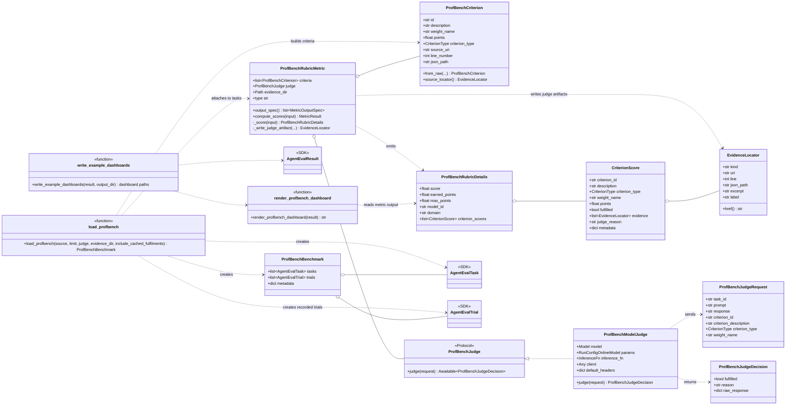

# ProfBench Agent-Eval Example

## Prerequisites

Complete the following before running any command below:

- **Python & uv**: Python 3.12+ with [`uv`](https://docs.astral.sh/uv/) and the repo synced (`uv sync`).
- **Inference access**: API access for the configured chat-completions model. The default `live-judge` and `live-candidate` paths call this model, so set the relevant key (for example `OPENAI_API_KEY` or `NVIDIA_API_KEY`) in your environment.
- **Codex agent (only for `--agent codex`)**: install the `nemo-evaluator-sdk[agent-runtimes]` extra. Then either:
  - `--runtime local`: the Codex CLI (`codex`) on `PATH` and authenticated (`codex login`).
  - `--runtime docker`: a running Docker daemon. Codex uses the SDK Docker sandbox when `OPENAI_API_KEY` is an OpenAI Platform key (`sk-…`); otherwise it runs the Codex CLI in a container with your local `~/.codex/auth.json` mounted read-only.

Run the example from the repository root:

- Local

```bash
python -m packages.nemo_evaluator_sdk.examples.profbench.runner \
  --output-dir env/profbench-results \
  --limit=1 \
  --agent codex \
  --runtime local \
  --agent-model gpt-5.5
```

- Docker

```bash
python -m packages.nemo_evaluator_sdk.examples.profbench.runner \
  --output-dir env/profbench-results \
  --limit=1 \
  --agent codex \
  --runtime docker \
  --agent-model gpt-5.5
```

Each invocation creates one run directory under `--output-dir`, then writes each enabled runner mode under that run:

```text
env/profbench-results/
  20260604_161501_61063_eb0cf0/
    baseline/
      evidence/
        profbench-dataset.jsonl
      report.html
      sdk-report.html
    live-judge/
      evidence/
        profbench-dataset.jsonl
        judge-*.json
      report.html
      sdk-report.html
    live-candidate/
      evidence/
        profbench-dataset.jsonl
        judge-*.json
      report.html
      sdk-report.html
```

Live paths are enabled by default and require API access through the configured model settings. Pass `--no-run-live-judge` or `--no-run-live-candidate` to skip either live path.

## Code Sandbox Invocation

The CLI runner above uses the configured chat-completions model directly for `live-candidate`. To run ProfBench with a Codex-style candidate agent, pass `--agent codex`. Docker is the default Codex runtime preference: it uses SDK Docker when `OPENAI_API_KEY` is an OpenAI Platform secret key, and otherwise starts a lightweight Docker container that runs Codex CLI with your local Codex auth mounted read-only.

```bash
python -m packages.nemo_evaluator_sdk.examples.profbench.runner \
  --output-dir env/profbench-results \
  --limit=1 \
  --agent codex \
  --agent-model gpt-5.4
```

List locally visible Codex model slugs before choosing `--agent-model`:

```bash
python -m packages.nemo_evaluator_sdk.examples.profbench.runner --agent codex --list-agent-models
```

Runtime and credential behavior:

- `--agent codex --runtime docker` prefers `DockerSandboxAgentRuntime` when `OPENAI_API_KEY` looks like an OpenAI Platform secret key (`sk-...`). Model calls are made by the OpenAI Agents SDK from the host process; the Docker container is the execution workspace and `~/.codex/auth.json` is not mounted.
- `--agent codex --runtime docker` falls back to Dockerized Codex CLI when `OPENAI_API_KEY` is missing or is a Codex OAuth token. It mounts `~/.codex/auth.json` read-only into a `node:22-alpine` container and runs `npx -y @openai/codex@0.137.0 exec ...`; Codex OAuth tokens are not converted into API keys. Because Docker is the isolation boundary, this path runs Codex with its nested shell-command sandbox disabled to avoid `bwrap` user-namespace failures inside the container.
- `--agent codex --runtime local` always uses host `codex exec` from `PATH`, so it relies on your local Codex login/auth. It passes `--ignore-user-config` so benchmark runs do not inherit `$CODEX_HOME/config.toml` MCP servers, plugins, approval settings, or other user-specific tool configuration. No Docker containers are expected in this mode.
- The live ProfBench judge still uses the regular NeMo Evaluator SDK model settings, so the default judge path still needs `NVIDIA_API_KEY` unless you override the judge model and secret settings.
- If `--agent-model` is omitted, SDK Docker uses the documented default Codex sandbox model; Dockerized/local CLI uses the default model in your Codex config.

Install the optional runtime extra for SDK Docker mode:

```bash
uv sync --frozen --package nemo-evaluator-sdk --extra agent-runtimes
```

The lower-level SDK equivalent is:

```bash
OPENAI_API_KEY=... NVIDIA_API_KEY=... \
uv run --frozen --package nemo-evaluator-sdk --extra agent-runtimes python - <<'PY'
import asyncio
from pathlib import Path

from nemo_evaluator_sdk.agent_eval.evaluator import AgentEvaluator
from nemo_evaluator_sdk.agent_eval.runtimes.docker_sandbox import DockerSandboxAgentRuntime
from nemo_evaluator_sdk.agent_eval.tasks import AgentEvalRunConfig
from nemo_evaluator_sdk.values import Model, SecretRef

from packages.nemo_evaluator_sdk.examples.profbench.profbench import (
    PROFBENCH_DATASET_URL,
    ProfBenchModelJudge,
    load_profbench,
    write_example_dashboards,
)


async def main() -> None:
    output_dir = Path("env/profbench-results/code-sandbox-smoke")
    judge_model = Model(
        url="https://integrate.api.nvidia.com/v1/chat/completions",
        name="nvidia/nemotron-3-nano-30b-a3b",
        api_key_secret=SecretRef(root="NVIDIA_API_KEY"),
    )
    benchmark = load_profbench(
        PROFBENCH_DATASET_URL,
        limit=1,
        judge=ProfBenchModelJudge(model=judge_model),
        evidence_dir=output_dir / "evidence",
        include_cached_fulfilments=False,
    )
    result = await AgentEvaluator().run(
        tasks=benchmark.tasks,
        target=DockerSandboxAgentRuntime(model="gpt-4.1-mini", timeout_s=180),
        config=AgentEvalRunConfig(
            output_dir=output_dir,
            run_id="profbench-code-sandbox-smoke",
            parallelism=1,
            benchmark={**benchmark.metadata, "score_source": "docker_sandbox_and_live_judge"},
            write_dashboard=False,
        ),
    )
    sdk_dashboard_path, dashboard_path = write_example_dashboards(result, output_dir)
    print(f"SDK dashboard: {sdk_dashboard_path}")
    print(f"Dashboard: {dashboard_path}")


asyncio.run(main())
PY
```

This writes the sandbox trial evidence under:

```text
env/profbench-results/code-sandbox-smoke/
  agent-runtime/profbench-code-sandbox-smoke/<task-id>/
    final_output.txt
    run_items.json
    raw_responses.json
    workspace.tar
    final_state/
  evidence/
    profbench-dataset.jsonl
    judge-*.json
  report.html
  sdk-report.html
```

Credential flow:

- `DockerSandboxAgentRuntime` uses the OpenAI Agents SDK `SandboxAgent`; model calls are made from the host process and use `OPENAI_API_KEY`.
- The Docker container is an execution sandbox for task workspace/files. It does not receive your API keys unless you explicitly mount or write them into the task workspace later.
- `ProfBenchModelJudge` uses the regular NeMo Evaluator SDK model path. In the example above, `SecretRef(root="NVIDIA_API_KEY")` resolves the judge key from the local `NVIDIA_API_KEY` environment variable.
- For the normal ProfBench CLI, the evaluated and judge models default to NVIDIA NIM. Configure them with `NEMO_EVALUATOR_PROFBENCH_EVALUATED_MODEL_URL`, `NEMO_EVALUATOR_PROFBENCH_EVALUATED_MODEL`, `NEMO_EVALUATOR_PROFBENCH_JUDGE_MODEL_URL`, and `NEMO_EVALUATOR_PROFBENCH_JUDGE_MODEL`. The API-key environment variable name defaults to `NVIDIA_API_KEY` and can be changed with `NMP_EVALUATOR_DEFAULT_API_KEY_SECRET`.

## Domain Model

| Concept | Meaning |
| :---- | :---- |
| Task | The unit of work being evaluated. It contains intent, inputs, metrics, and optional views. |
| Benchmark | An immutable collection of agent evaluation tasks. |
| Run | One agent evaluated against one benchmark. |
| Trial | One agent execution or imported trace-derived trial for one task. |
| Evidence | Final output, final state, traces, logs, measurements, labels, and review artifacts captured for a trial. |
| Metric | An SDK `Metric` implementation that consumes `MetricInput` and emits outputs declared by `output_spec()`. |
| Score | Metric outputs and diagnostics produced for one trial and one metric. |

The key relationship is simple: benchmarks list tasks, tasks declare metrics, runs contain trials, trials have evidence, and scores grade trials with metrics. Ordered task refs can live on benchmarks. Ordered metric refs can live on tasks.

Use case → user inputs and expected outputs →(mapped to) tasks → metrics

## Runner Types

`run_examples` always runs the **baseline** path; the other two run by default and can be disabled with `--no-run-live-judge` and `--no-run-live-candidate`. They differ along two axes: **whose answers are scored** and **how rubrics are decided**.

## Comparison

| | **Baseline** | **Live judge** | **Live candidate** |
|---|---|---|---|
| **Answers** | Pre-recorded in the dataset (`o3`, `r1-0528`, `grok4`) | Same pre-recorded answers | **New** answers from `_evaluated_model()` |
| **Rubric scoring** | Dataset labels (`{model}_fulfilment` in JSONL) | Live LLM judge per criterion | Live LLM judge per criterion |
| **API / cost** | None (offline) | Judge calls only | Inference + judge calls |
| **Default in `run_examples`** | Always | Enabled by default (`--no-run-live-judge` disables) | Enabled by default (`--no-run-live-candidate` disables) |

## 1. `run_profbench_baseline_example` - reproduce published scores

```python
async def run_profbench_baseline_example(
    *,
    limit: int | None,
    output_root: str | Path | None = None,
    run_instance_id: str | None = None,
) -> None:
    """Score the ProfBench baseline model responses bundled in the dataset."""
    ...
    output_dir = _profbench_output_dir(output_root, run_instance_id, "baseline")
    benchmark = load_profbench(_profbench_source(), limit=limit, evidence_dir=output_dir / "evidence")
    result = await AgentEvaluator().run(
        tasks=benchmark.tasks,
        trials=benchmark.trials,
        ...
    )
```

- `load_profbench` with **no judge** and `include_cached_fulfilments=True` (default).
- Each trial gets `profbench_fulfilments` from the dataset; `ProfBenchRubricMetric` uses those (`score_source: "dataset_label"`) and never calls a judge.
- Fast, deterministic check that loading and scoring work without credentials.

## 2. `run_profbench_live_judge_example` - same text, new judge

```python
benchmark = load_profbench(
    _profbench_source(),
    limit=limit,
    judge=ProfBenchModelJudge(model=judge_model),
    evidence_dir=output_dir / "evidence",
    include_cached_fulfilments=False,
)

result = await AgentEvaluator().run(
    tasks=benchmark.tasks,
    trials=benchmark.trials,
    ...
)
```

- Still scores the **bundled** baseline responses via `trials=benchmark.trials`.
- `include_cached_fulfilments=False` drops precomputed labels so every criterion goes through `ProfBenchModelJudge` (`score_source: "judge"`).
- Useful to validate your judge model/setup against fixed candidate outputs, without running the candidate model.

## 3. `run_profbench_live_candidate_example` - generate + judge

```python
evaluated_model = _evaluated_model()
params = RunConfigOnlineModel(
    parallelism=2,
    inference=InferenceParams(temperature=0.0, max_tokens=32768),
)
result = await AgentEvaluator().run(
    tasks=benchmark.tasks,
    target=evaluated_model,
    config=AgentEvalRunConfig(
        output_dir=output_dir,
        params=params,
        benchmark={**benchmark.metadata, "score_source": "fresh_candidate_and_live_judge"},
        ...
    ),
)
```

- **No** `trials=` - the evaluator calls the **target** model (`RunConfigOnlineModel`, parallelism 2, `temperature=0`, `max_tokens=32768`) to produce answers, then scores them with the same live judge. Reasoning models that exhaust the token budget without emitting final `content` fall back to their `reasoning_content` so the trial stays scorable.
- Full "evaluate my model on ProfBench" path: new responses + live rubric judging.
- Most expensive; needs inference and judge API access.

## Scoring Logic

All three use `ProfBenchRubricMetric`. Cached labels win when present; otherwise a judge is required:

```python
if criterion.id in fulfilments:
    fulfilled = fulfilments[criterion.id]
else:
    if self.judge is None:
        raise ValueError("ProfBench candidate scoring requires a judge when dataset labels are absent")
    score_source = "judge"
```

- **Baseline**: fulfilments always present, so it uses dataset labels only.
- **Live judge / live candidate**: fulfilments are stripped, so the judge runs on every criterion; candidate path additionally supplies fresh `output_text` from the target model instead of dataset response fields.

## Class Diagram

How the ProfBench example adapts the generic SDK agent-eval types. Boxes marked `<<SDK>>` are imported from `nemo_evaluator_sdk.agent_eval`; the others are ProfBench-specific.



Reading guide:

- `o--` means "contains"; `..>` means "uses/creates/depends on"; `<|..` means "implements protocol"; `<<function>>` marks module-level helpers; `+`/`-` mark public/private members.
- `load_profbench()` reads the JSONL dataset and returns a `ProfBenchBenchmark` of SDK `AgentEvalTask` and recorded `AgentEvalTrial` objects.
- Each task gets one `ProfBenchRubricMetric` configured with `ProfBenchCriterion` objects. Baseline scoring uses cached dataset labels; live scoring uses a `ProfBenchJudge` (concretely `ProfBenchModelJudge`).
- The metric emits generic SDK metric outputs whose detailed value is a `ProfBenchRubricDetails`; the dashboard reads those to render model scores, criterion scores, and evidence links.
- `ProfBenchCriterion.source_locator()` links each criterion back to the copied dataset JSONL, live judge decisions are written as `judge-*.json`, and each `CriterionScore` points at `EvidenceLocator` entries so the report can link back to source and judge evidence.

## Execution Flow

End-to-end control flow across the three runner paths. Baseline always runs first; the two live paths are gated by `--run-live-judge` / `--run-live-candidate`.

```mermaid
flowchart TD
    Start([CLI starts runner.py])
    Parse[Parse args and configure logging]
    ResolveRun[Resolve output root and create run id]
    CreateRunDir[Create output-dir/run-id]

    Start --> Parse --> ResolveRun --> CreateRunDir

    subgraph Baseline["Baseline path - always runs"]
        LoadBaseline[load_profbench with cached fulfilments]
        ScoreBaseline[AgentEvaluator.run with recorded trials]
        DatasetLabels[ProfBenchRubricMetric uses dataset labels]
        PersistBaseline[Persist baseline run bundle]
        DashBaseline[Write baseline sdk-report.html and report.html]

        LoadBaseline --> ScoreBaseline --> DatasetLabels --> PersistBaseline --> DashBaseline
    end

    CreateRunDir --> LoadBaseline

    DashBaseline --> RunLiveJudge{run_live_judge?}
    RunLiveJudge -- no --> SkipJudge[Skip live-judge directory]
    RunLiveJudge -- yes --> LoadLiveJudge[load_profbench recorded answers without cached fulfilments]

    subgraph LiveJudge["Live judge path - recorded answers, live rubric judge"]
        LoadLiveJudge --> ScoreRecorded[AgentEvaluator.run with recorded trials]
        ScoreRecorded --> JudgeRecorded[For each criterion call ProfBenchModelJudge]
        JudgeRecorded --> JudgeArtifactsA[Write live-judge/evidence/judge-*.json]
        JudgeArtifactsA --> PersistLiveJudge[Persist live-judge run bundle]
        PersistLiveJudge --> DashLiveJudge[Write live-judge dashboards]
    end

    SkipJudge --> RunLiveCandidate{run_live_candidate?}
    DashLiveJudge --> RunLiveCandidate

    RunLiveCandidate -- no --> SkipCandidate[Skip live-candidate directory]
    RunLiveCandidate -- yes --> ResolveModels[Resolve evaluated model and judge model]

    subgraph LiveCandidate["Live candidate path - fresh answers, live rubric judge"]
        ResolveModels --> LoadLiveCandidate[load_profbench tasks without cached fulfilments]
        LoadLiveCandidate --> GenerateTrials[Generate fresh trials with evaluated model]
        GenerateTrials --> ScoreFresh[Score generated trials]
        ScoreFresh --> JudgeFresh[For each criterion call ProfBenchModelJudge]
        JudgeFresh --> JudgeArtifactsB[Write live-candidate/evidence/judge-*.json]
        JudgeArtifactsB --> PersistLiveCandidate[Persist live-candidate run bundle]
        PersistLiveCandidate --> DashLiveCandidate[Write live-candidate dashboards]
    end

    SkipCandidate --> Done([Runner prints paths and exits])
    DashLiveCandidate --> Done
```



What happens in the full live-candidate path:

1. `runner.py` parses CLI args, resolves the output root, creates one run id, and creates `<output-dir>/<run-id>/`.
2. Baseline runs first: it loads ProfBench, scores recorded trials with dataset labels, persists baseline files, and writes dashboards.
3. The live-candidate path resolves two models: the evaluated model and the judge model.
4. `load_profbench()` loads tasks with `include_cached_fulfilments=False`, so cached labels are removed and the metric must call the judge.
5. `AgentEvaluator.run(tasks=..., target=evaluated_model, ...)` generates fresh candidate trials: for each task it calls `_generate_sample()` against the evaluated model and converts the returned sample into an `AgentEvalTrial`.
6. The evaluator then scores those generated trials with `ProfBenchRubricMetric`. For each rubric criterion it calls `ProfBenchModelJudge`, which calls `_generate_sample()` against the judge model, parses the judge output into a yes/no decision, writes `evidence/judge-*.json`, and returns `MetricResult` outputs.
7. `AgentEvaluator` builds the summary, persists the run bundle (`benchmark.json`, `tasks.jsonl`, `trials.jsonl`, `scores.jsonl`, `summary.json`, `run.json`), and `write_example_dashboards()` writes `sdk-report.html` and the ProfBench-specific `report.html`.

The evaluated model produces the candidate answer and the judge model evaluates each rubric criterion. They can point to the same model configuration, but the code treats them as separate roles.
