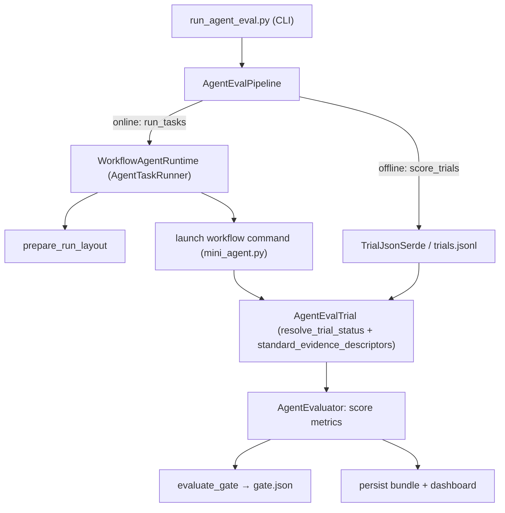

# run_agent_eval — workflow runtime over the trials API

A minimal, self-contained example that runs agent-eval tasks through a
**workflow runtime** and scores them with the trials-based
`nemo_evaluator_sdk.agent_eval` SDK, following the standard shape: load task →
run agent → score → gate, plus offline rescoring.

It offers two paths:

- a **toy path** (the default) whose agent is a tiny bundled script
  (`mini_agent.py`), so it runs **end to end with no external infrastructure**;
- a **real path** (`--agentic-task <name>`) whose `platform_runtime.py` glue
  runs an actual `tests/agentic-use` task through Docker + `nat run` + a pytest
  verifier (see [Running a real `tests/agentic-use`
  task](#running-a-real-testsagentic-use-task)).

## What it demonstrates

The SDK stays responsible for generating trials and scoring them; the example
owns the CI-policy glue (the pass/fail gate, the pipeline wrapper, the
Harbor-style verifier, and the run layout). Components and the building blocks
they use (SDK unless noted *example-local*):

| Component | File | Role / building blocks |
|---|---|---|
| `WorkflowAgentRuntime` | `workflow_runtime.py` | `AgentTaskRunner` (toy host-subprocess agent): `resolve_trial_status`, `standard_evidence_descriptors` (SDK) + `prepare_run_layout` (example-local `layout.py`) |
| `TrialJsonSerde` | `workflow_runtime.py` | `AgentTrialSerde`: offline read/write of a stored `AgentEvalTrial` |
| Tasks + metrics | `workflow_runtime.py` | `AgentPhaseSuccessMetric`, `EvidencePresenceMetric`, a task-authored `OutputContainsMetric` |
| CLI harness | `run_agent_eval.py` | `AgentEvaluator` (SDK) via the example-local `AgentEvalPipeline` (`pipeline.py`) + gate (`gating.py`) |
| `mini_agent.py` | `mini_agent.py` | default agent — a dependency-free stand-in workflow |
| `NatWorkflowRuntime` | `platform_runtime.py` | `AgentTaskRunner` (real Docker + `nat run`), plus `agentic_task_from_dir`, `ensure_task_image`, `VerifierRewardMetric`; verify via example-local `verify.py` |
| `NatAutRuntime` | `aut_runtime.py` | `AgentTaskRunner` (deployed agent-under-test); `usage.py` extracts token usage from its logs |

## Run it

From the repository root:

```bash
# Online: run the workflow agent on every example task, score, and gate.
python -m packages.nemo_evaluator_sdk.examples.run_agent_eval.run_agent_eval --task all

# A single task.
python -m packages.nemo_evaluator_sdk.examples.run_agent_eval.run_agent_eval --task write-report

# List available tasks.
python -m packages.nemo_evaluator_sdk.examples.run_agent_eval.run_agent_eval --list-tasks
```

Each online run writes a bundle to `run-agent-eval-output/`
(`tasks.jsonl`, `trials.jsonl`, `scores.jsonl`, `summary.json`, `gate.json`,
`report.html`) plus per-task evidence under `evidence/workflow/<task>/`.

Example output:

```text
run_id: agent-eval-20260620195929
tasks: 2  trials: 2
  agent_phase_success.agent_phase_success: 2/2 true
  evidence_presence.evidence_present: 2/2 true
  output_contains.output_contains: 2/2 true
output_dir: .../run-agent-eval-output
gate: .../run-agent-eval-output/gate.json
```

> The metrics here emit booleans, which aggregate as `nan` in the numeric
> `summary.scores` view (that view is for range scores); the example summarizes
> them as a true-rate instead, and the gate reads `agent_phase_success` as the
> per-task pass signal.

### Offline rescoring (no agent execution)

Re-score already-captured trials through the same pipeline. Pass either a full
run bundle (reads `trials.jsonl`) or a single runtime run dir (reads
`trial.json` via `TrialJsonSerde`):

```bash
# Re-score an entire prior bundle.
python -m packages.nemo_evaluator_sdk.examples.run_agent_eval.run_agent_eval \
  --rescore-dir run-agent-eval-output --output-dir /tmp/rescore

# Re-score one captured run dir via the serde.
python -m packages.nemo_evaluator_sdk.examples.run_agent_eval.run_agent_eval \
  --rescore-dir run-agent-eval-output/evidence/workflow/write-report --output-dir /tmp/rescore-one
```

## Execution flow



## Plugging in a real workflow

`WorkflowAgentRuntime` launches `config.command` per task, substituting the
tokens `{instruction}`, `{workspace}`, and `{input_json}`. The default runs the
bundled `mini_agent.py`; supply your own command to drive a real agent:

```python
from nemo_evaluator_sdk.examples.run_agent_eval.workflow_runtime import (
    WorkflowAgentRuntime,
    WorkflowRuntimeConfig,
)

runtime = WorkflowAgentRuntime(
    WorkflowRuntimeConfig(
        command=["nat", "run", "--config", "workflow.yml", "--input", "{instruction}"],
        agent_model="my-model",
    )
)
```

Any executable that reads the task input, writes results into `{workspace}`,
prints a final answer to stdout, and exits non-zero on failure works unchanged.

## Running a real `tests/agentic-use` task

`platform_runtime.py` adds the NeMo-Platform-specific glue the toy path
deliberately omits, so the example can drive a **real** agentic-use task through
the same three phases as `nat_runner`:

1. **BUILD** — `ensure_task_image` builds the task's `environment/Dockerfile`
   (or `environment.yaml`) into `nmp-nat-<task>:latest`.
2. **AGENT** — `NatWorkflowRuntime` runs `nat run --config_file workflow.yml`
   inside that image via the SDK's `DockerEnvironmentProvider`, capturing
   `nat_agent.log` + `trajectory.json`.
3. **VERIFY** *(optional)* — runs the task's `tests/test_outputs.py` under pytest
   in the same image; the reward is scored by `VerifierRewardMetric`.

Each run records the same token/runtime measurements `nat_runner` writes into
`result.json["metrics"]`: `usage.py` is the port of `nat_runner`'s
`_extract_usage_metrics`, and `build_trial_from_artifacts` stamps
`prompt_tokens`/`completion_tokens`/`total_tokens`/`cache_*` + `runtime_sec` onto
each trial so the summary, gate, and dashboard aggregates populate.

### Two backends (`--backend`)

`nat_runner` supports a task-local `nat run` **workflow** backend and a deployed
**agent-under-test (AUT)** backend; this example mirrors both.

The **workflow** backend runs a task-local `nat run`:

```bash
python -m packages.nemo_evaluator_sdk.examples.run_agent_eval.run_agent_eval \
  --agentic-task entities-basic-cli-easy --backend workflow --verify \
  --agent-model meta/llama-3.3-70b-instruct --output-dir ~/rae-real
```

The **AUT** backend (`aut_runtime.py`) runs the full `nat_runner` lifecycle
inside the task image: create the agent from `--aut-agent-config` → seed
inference providers (`providers.yaml`) → deploy → wait → health-check → invoke
via `nat_trace_export.py invoke-aut`.

### A task-capable AUT agent (verified green)

The deployed agent must have the tools its task needs. `nemo-mcp` currently
exposes only **workspace** operations (`create_workspace`, `list_workspaces`,
`delete_workspace`), so `aut_agent.workspace.example.yml` is matched to
`workspace-basic-mcp` — a task those MCP tools fully cover — and scores a green
verifier reward end to end:

```bash
INFERENCE_NVIDIA_API_KEY=<key> \
python -m packages.nemo_evaluator_sdk.examples.run_agent_eval.run_agent_eval \
  --agentic-task workspace-basic-mcp --backend aut \
  --aut-agent-name run-agent-eval-workspace \
  --aut-agent-config packages/nemo_evaluator_sdk/examples/run_agent_eval/aut_agent.workspace.example.yml \
  --agent-model vm-opus-nemotron-random --verify --output-dir ~/rae-workspace
```

```text
run_id: agent-eval-20260620211345
tasks: 1  trials: 1
  agent_phase_success.agent_phase_success: 1/1 true
  agentic_use_verifier_reward.verifier_reward: mean=1.000
  runtime_sec: 87.9 across 1/1 trials
gate: ~/rae-workspace/gate.json  (gate_passed: true, pass_rate=1.000)
```

> **Model routing note.** `providers.yaml` seeds `vm-opus-nemotron-random`, a
> 50/50 random-routing virtual model. The config sets
> `use_native_tool_calling: false` so the ReAct agent emits text-based steps with
> non-empty content; some routed backends reject the empty-content assistant
> messages that native tool-calling produces. Token totals stay `null` for the
> AUT backend because this platform's invoke endpoint streams only the answer
> text, not per-message `usage` — `runtime_sec` is still recorded.
>
> **Prerequisites (real path):** a working Docker daemon, the
> `nmp-agentic-base:latest` base image, and `NVIDIA_API_KEY`. The AUT backend
> additionally needs an inference model the platform **inference gateway**
> exposes as a valid model entity: either set `INFERENCE_NVIDIA_API_KEY` so
> `providers.yaml` seeds its virtual model and pass that as `--agent-model`, or
> point `--agent-model` at a discovered IGW model-entity name. A provider model
> id with slashes/dots (e.g. `meta/llama-3.3-70b-instruct`) is rejected by the
> gateway's OpenAI route — same model-routing setup `nat_runner` requires. Real
> runs fail fast with a clear message and exit non-zero; the toy path needs none
> of this.

| Flag | Purpose |
|---|---|
| `--agentic-task <name>` | Run `tests/agentic-use/<name>` end to end. |
| `--backend {workflow,aut}` | Task-local `nat run` vs. deployed agent-under-test. |
| `--aut-agent-name` | Name of the deployed AUT (aut backend). |
| `--aut-agent-config` | NAT config for the AUT; created/recreated if needed. |
| `--no-seed-providers` | Skip seeding `providers.yaml` (aut backend). |
| `--skip-build` | Skip BUILD; require `nmp-nat-<name>:latest` to already exist. |
| `--verify` | Run the pytest VERIFY phase and add `VerifierRewardMetric`. |
| `--nmp-base-url` | Platform URL injected into the workflow/agent + containers. |
| `--agent-model` | Model for the workflow / AUT agent. |

## Files

- `run_agent_eval.py` — CLI harness (toy online + offline rescore + real task + gate).
- `workflow_runtime.py` — toy runtime adapter, trial serde, example tasks, metric.
- `platform_runtime.py` — NeMo-Platform glue + workflow backend (BUILD/AGENT/VERIFY).
- `aut_runtime.py` — AUT backend: create/seed/deploy/invoke a deployed agent.
- `usage.py` — token-usage extraction ported from `nat_runner._extract_usage_metrics`.
- `aut_agent.workspace.example.yml` — task-capable AUT config matched to `workspace-basic-mcp` (verified green).
- `mini_agent.py` — dependency-free stand-in agent (the default toy workflow).
