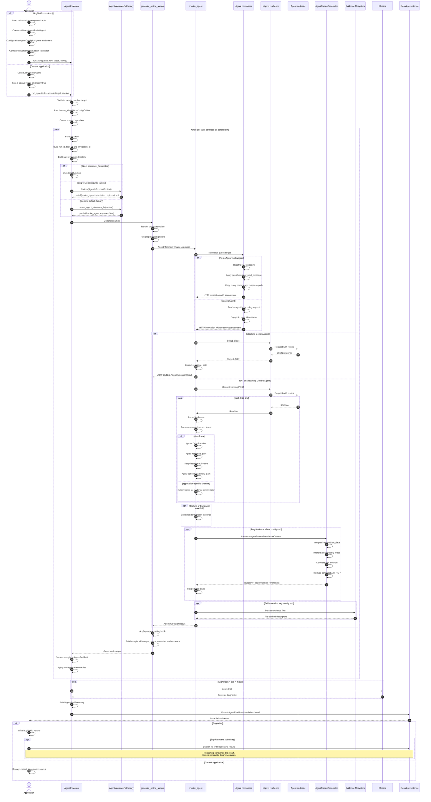
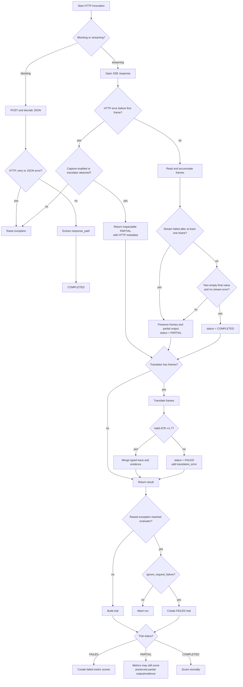

## GenericAgent vs NemoAgentToolkitAgent
The central mental model is:

> BugNeMo and a generic application select different public agent variants, but both become the same internal HTTP invocation. BugNeMo adds domain-specific interpretation through a translator; the transport remains shared.

“NatAgent” in this design means `NemoAgentToolkitAgent` plus `NatAgentConfig`.

### 1. Complete architecture flow

```mermaid
flowchart TB
    %% ─────────────────────────────
    %% APPLICATION CONFIGURATION
    %% ─────────────────────────────

    subgraph BUG["BugNeMo count-only evaluation"]
        B0["Load task bundle"]
        B1["Generate or load frozen ground truth"]
        B2{"All tasks belong to<br/>count family?"}
        B3["NemoAgentToolkitAgent<br/>format = nemo_agent_toolkit"]
        B4["NatAgentConfig<br/>endpoint = /generate/stream<br/>request_mode = passthrough<br/>response_path = $..value"]
        B5["BugNemoNatStreamTranslator"]
        B6["partial make_agent_inference_fn<br/>translator = BugNeMo translator<br/>capture_evidence = true"]
        B7["AgentEvaluator<br/>agent_inference_fn_factory = BugNeMo factory"]

        B0 --> B1 --> B2
        B2 -- yes --> B3 --> B4
        B5 --> B6
        B4 --> B7
        B6 --> B7

        B2 -. other families .-> BX["BugNemoStreamRuntime<br/>existing custom runtime path"]
    end

    subgraph GENERIC["Example: customer-support evaluation"]
        G0["Load application tasks"]
        G1["GenericAgent<br/>format = generic<br/>body = request template<br/>response_path = $.answer"]
        G2{"Streaming endpoint?"}
        G3["stream = true<br/>optional trajectory_path"]
        G4["stream = false<br/>blocking JSON"]
        G5["AgentEvaluator<br/>default factory"]
        G6["Optional custom factory<br/>capture_evidence = true<br/>optional translator"]

        G0 --> G1 --> G2
        G2 -- JSON SSE --> G3 --> G5
        G2 -- JSON response --> G4 --> G5
        G6 -. optional override .-> G5
    end

    %% ─────────────────────────────
    %% EVALUATOR ORCHESTRATION
    %% ─────────────────────────────

    B7 --> E0
    G5 --> E0

    subgraph EVALUATOR["Shared AgentEvaluator orchestration"]
        E0["run_sync → run"]
        E1["Validate tasks and target"]
        E2["Assign run_id"]
        E3["Resolve RunConfigOnline"]
        E4["Create concurrency semaphore"]
        E5["For each task"]
        E6["Build agent_eval_context<br/>run_id<br/>task_id<br/>invocation_id"]
        E7["Build safe per-task evidence directory"]
        E8{"Direct inference_fn supplied?"}
        E9["Use direct function<br/>factory is bypassed"]
        E10["Select configured factory<br/>or make_agent_inference_fn"]
        E11["Factory receives<br/>AgentInferenceContext"]
        E12["Returns AgentInferenceFn<br/>partial invoke_agent"]

        E0 --> E1 --> E2 --> E3 --> E4 --> E5
        E5 --> E6 --> E7 --> E8
        E8 -- yes --> E9
        E8 -- no --> E10 --> E11 --> E12
    end

    %% ─────────────────────────────
    %% REQUEST CREATION
    %% ─────────────────────────────

    E9 --> S0
    E12 --> S0

    subgraph SAMPLE["Shared sample generation"]
        S0["Render prompt_template<br/>using task row and agent_eval context"]
        S1["Run request preprocessing hooks"]
        S2["Call AgentInferenceFn"]
        S0 --> S1 --> S2
    end

    %% ─────────────────────────────
    %% PUBLIC MODEL NORMALIZATION
    %% ─────────────────────────────

    S2 --> N0

    subgraph NORMALIZE["Normalize public agent into immutable HTTP invocation"]
        N0{"Which discriminator variant?"}

        N1["NemoAgentToolkitAgent"]
        N2["Resolve NAT endpoint"]
        N3["Apply input_message or passthrough mode"]
        N4["Forward NAT query parameters"]
        N5["Set response mode = SSE"]

        N6["GenericAgent"]
        N7["Render GenericAgent.body"]
        N8["Use GenericAgent.url"]
        N9["Copy response_path and trajectory_path"]
        N10{"GenericAgent.stream?"}
        N11["Set response mode = SSE"]
        N12["Set response mode = blocking JSON"]

        N0 -- nemo_agent_toolkit --> N1 --> N2 --> N3 --> N4 --> N5
        N0 -- generic --> N6 --> N7 --> N8 --> N9 --> N10
        N10 -- true --> N11
        N10 -- false --> N12
    end

    %% ─────────────────────────────
    %% SHARED HTTP ENGINE
    %% ─────────────────────────────

    N5 --> H0
    N11 --> H0
    N12 --> H1

    subgraph HTTP["One shared HTTP engine"]
        H0["Streaming HTTP POST"]
        H1["Blocking HTTP POST"]
        H2["Apply headers and authentication"]
        H3["Execute through resilience scheduler"]
        H4["Decode response.json"]
        H5["Extract response_path"]
        H6["Return completed AgentInvocationResult"]

        H7["Read response line by line"]
        H8["Retain raw line"]
        H9["Parse SSE field into SseFrame"]
        H10{"Frame channel?"}
        H11["Retain non-data fields as evidence"]
        H12{"Payload is DONE?"}
        H13["Ignore terminal marker"]
        H14["Apply response_path"]
        H15["Last non-null response match wins"]
        H16["Apply trajectory_path when configured"]
        H17["Last non-null trajectory match wins"]
        H18["Record stream or payload error"]

        H0 --> H2 --> H3 --> H7
        H1 --> H2
        H2 --> H3
        H3 --> H4 --> H5 --> H6

        H7 --> H8 --> H9 --> H10
        H10 -- non-data field --> H11 --> H7
        H10 -- data --> H12
        H12 -- yes --> H13 --> H7
        H12 -- no --> H14 --> H15 --> H16 --> H17 --> H18 --> H7
    end

    %% ─────────────────────────────
    %% STREAM INTERPRETATION
    %% ─────────────────────────────

    H7 --> T0

    subgraph TRANSLATION["Optional stream translation and evidence"]
        T0["SSE stream ends"]
        T1["Build standard stream evidence<br/>raw_stream<br/>stream_events<br/>request_payload<br/>request_headers<br/>http_metadata"]
        T2{"Translator configured<br/>and frames exist?"}
        T3["Build AgentStreamTranslationContext"]
        T4["Call AgentStreamTranslator"]
        T5{"Translation valid?"}
        T6["Merge canonical ATIF trace<br/>and application evidence"]
        T7["Set invocation status = FAILED<br/>add translation_error evidence"]
        T8{"Evidence directory configured?"}
        T9["Persist evidence safely<br/>replace inline data with file refs"]
        T10["Return AgentInvocationResult"]

        T0 --> T1 --> T2
        T2 -- yes --> T3 --> T4 --> T5
        T5 -- yes --> T6 --> T8
        T5 -- no --> T7 --> T8
        T2 -- no --> T8
        T8 -- yes --> T9 --> T10
        T8 -- no --> T10
    end

    %% ─────────────────────────────
    %% BUGNEMO TRANSLATOR DETAILS
    %% ─────────────────────────────

    B5 -. implementation of generic protocol .-> BT0

    subgraph BUGTRANSLATOR["BugNeMo-specific semantic adapter"]
        BT0["Receive all SseFrame objects"]
        BT1["Select intermediate_data frames"]
        BT2["Select observability_trace frames"]
        BT3["Coalesce repeated same-ID updates"]
        BT4["Correlate tool start, complete and failure"]
        BT5["Build ATIF-v1.7 user, agent and tool steps"]
        BT6["Add tool_evidence"]
        BT7["Add final_answer"]
        BT8["Add observability_trace"]
        BT9["Return AgentStreamTranslation"]

        BT0 --> BT1 --> BT2 --> BT3 --> BT4 --> BT5
        BT5 --> BT6 --> BT7 --> BT8 --> BT9
    end

    BT9 -. returned to shared engine .-> T5

    %% ─────────────────────────────
    %% SAMPLE, TRIAL, SCORING
    %% ─────────────────────────────

    H6 --> A0
    T10 --> A0

    subgraph RESULT["Adapt invocation into evaluation result"]
        A0["Process response and output text"]
        A1["Build generated sample"]
        A2["Attach invocation status, metadata and evidence"]
        A3["Convert sample into AgentEvalTrial"]
        A4{"Evidence precedence"}
        A5["trajectory exists:<br/>merge without replacing typed trace"]
        A6["typed evidence only:<br/>preserve unchanged"]
        A7["neither exists:<br/>create fallback trace"]
        A8["Keep evaluator metadata authoritative"]
        A9["Run every task metric"]
        A10["Build scores and diagnostics"]
        A11["Build AgentEvalResult and summary"]
        A12["Persist result bundle and dashboard"]

        A0 --> A1 --> A2 --> A3 --> A4
        A4 -- trajectory --> A5 --> A8
        A4 -- typed evidence --> A6 --> A8
        A4 -- neither --> A7 --> A8
        A8 --> A9 --> A10 --> A11 --> A12
    end

    %% ─────────────────────────────
    %% APPLICATION CONSUMERS
    %% ─────────────────────────────

    A12 --> BO["BugNeMo writes reports"]
    A12 --> GO["Generic application consumes<br/>scores, trials and evidence"]
    A12 -. explicit optional consumer .-> INTAKE["publish_to_intake result<br/>does not rerun the agent"]

    classDef bug fill:#fde68a,stroke:#b45309,color:#111827;
    classDef generic fill:#bfdbfe,stroke:#1d4ed8,color:#111827;
    classDef shared fill:#dcfce7,stroke:#15803d,color:#111827;
    classDef evidence fill:#f3e8ff,stroke:#7e22ce,color:#111827;
    classDef output fill:#fee2e2,stroke:#b91c1c,color:#111827;

    class B0,B1,B2,B3,B4,B5,B6,B7,BT0,BT1,BT2,BT3,BT4,BT5,BT6,BT7,BT8,BT9,BO bug;
    class G0,G1,G2,G3,G4,G5,G6,GO generic;
    class E0,E1,E2,E3,E4,E5,E6,E7,E8,E9,E10,E11,E12,S0,S1,S2,N0,N1,N2,N3,N4,N5,N6,N7,N8,N9,N10,N11,N12,H0,H1,H2,H3,H4,H5,H6,H7,H8,H9,H10,H11,H12,H13,H14,H15,H16,H17,H18 shared;
    class T0,T1,T2,T3,T4,T5,T6,T7,T8,T9,T10 evidence;
    class A0,A1,A2,A3,A4,A5,A6,A7,A8,A9,A10,A11,A12,INTAKE output;
```



The critical convergence point is `_resolve_http_agent_invocation()`. Everything above it is public application configuration; everything below it is shared transport and evaluation infrastructure.

### 2. Debugger-style sequence



### 3. Status and failure behavior



Important nuance: `PARTIAL` is still inspectable and can be scored. `FAILED` is reserved for cases such as translation failure or an evaluator-converted request failure.

### 4. The two application configurations

BugNeMo supplies domain knowledge:

```python
target = NemoAgentToolkitAgent(
    url=agent_url,
    name="bugnemo-stream",
    nat=NatAgentConfig(
        endpoint=agent_url,
        request_mode="passthrough",
        query_params={},
        response_path="$..value",
    ),
)

evaluator = AgentEvaluator(
    agent_inference_fn_factory=partial(
        make_agent_inference_fn,
        stream_translator=BugNemoNatStreamTranslator(),
        capture_evidence=True,
    ),
)
```

A generic streaming application needs no NAT configuration:

```python
target = GenericAgent(
    url="https://support.example.com/answer/stream",
    name="customer-support-agent",
    body={"question": "{{ prompt }}"},
    response_path="$.answer",
    trajectory_path="$.trajectory",
    stream=True,
)

evaluator = AgentEvaluator(
    agent_inference_fn_factory=partial(
        make_agent_inference_fn,
        capture_evidence=True,
    ),
)
```

For blocking JSON, the generic application only changes `stream=False`.

### 5. What belongs where

| Layer | BugNeMo | Generic application | Shared SDK |
|---|---|---|---|
| Public target | `NemoAgentToolkitAgent` | `GenericAgent` | Discriminated `Agent` union |
| Request defaults | `NatAgentConfig` | `body`, URL, JSONPaths | Normalization |
| Transport | JSON SSE | JSON or JSON SSE | One HTTP engine |
| Domain interpretation | `BugNemoNatStreamTranslator` | Usually none; optional custom translator | Generic translator protocol |
| Evidence | ATIF, tool evidence, observability, raw stream | Raw stream and optional trajectory | Capture and persistence |
| Evaluation | BugNeMo metrics | Application metrics | Trial creation, scoring, summary |

The design deliberately separates three questions:

1. **What target is this?** Public discriminator model.
2. **How do I communicate with it?** Shared HTTP engine.
3. **What do its proprietary stream events mean?** Optional application translator.

