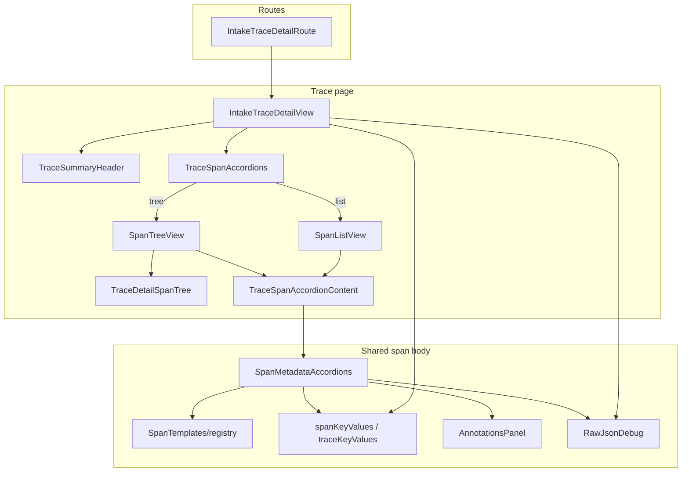

<!--
SPDX-FileCopyrightText: Copyright (c) 2025-2026 NVIDIA CORPORATION & AFFILIATES. All rights reserved.
SPDX-License-Identifier: Apache-2.0
-->

# Intake Detail

Trace and span detail UI: trajectory explorer, per-span bodies, kind templates, and shared atoms. List views (traces/spans tables) live in `IntakeLists/`.

Span templates provide specialized view for each known KIND template, with a fallback for unknown kinds. To review the output of these templates, run the seed script at:
services/intake/scripts/spans/seed_span_type_showcase.py.

## Architecture



| Layer                           | Role                                                                                                                       |
| ------------------------------- | -------------------------------------------------------------------------------------------------------------------------- |
| **Routes**                      | Thin wrappers; resolve workspace + id, set breadcrumbs. `IntakeTraceDetailContent` is exported for experiment trace reuse. |
| **IntakeTraceDetailView**       | Page header, trace summary header, span explorer, trace-level Attributes / Experiment Context accordions, raw JSON debug.  |
| **TraceSpanAccordions**         | Fetches span summaries and trace annotations; Tree/List toggle; expand/collapse toolbar; row headers + feedback.           |
| **SpanTreeView / SpanListView** | Layout shells for tree vs list modes; shared row chrome (`SpanTriggerLabel`, `SpanTriggerMeta`, `SpanFeedbackControls`).   |
| **TraceSpanAccordionContent**   | Lazy `useGetSpan` when a span body is shown; merges list summary with full detail via `mergeSpanDetails`.                  |
| **SpanMetadataAccordions**      | Single source of truth for span body inside the trace explorer.                                                            |
| **SpanTemplates/**              | Per-`SpanKind` descriptors + content components; registered in `registry.ts`.                                              |
| **traceSpanShared.ts**          | Note-focus nonces and accordion DOM ids shared by the explorer views.                                                      |
| **IntakeComponents/**           | Shared UI: key/value grids, payloads, status badges, feedback controls, `spanKeyValues` / `traceKeyValues`.                |

## Tree vs list layout

`TraceSpanAccordions` exposes a **Tree | List** toggle. Both views share row headers (`SpanTriggerLabel`, `SpanTriggerMeta`, `SpanFeedbackControls`) and the same body via `TraceSpanAccordionContent` → `SpanMetadataAccordions`.

|                  | **Tree** (`SpanTreeView`)                                          | **List** (`SpanListView`)                   |
| ---------------- | ------------------------------------------------------------------ | ------------------------------------------- |
| **Layout**       | `TraceDetailSpanTree` (left, `lg+` only) + selected span panel     | Flat `IntakeAccordion` of every span        |
| **Selection**    | Click tree node → show that span's body in the right panel         | Expand accordion row inline                 |
| **Row chrome**   | Fixed header bar above the body (not an accordion trigger)         | Accordion trigger + `slotEnd` feedback      |
| **Expand all**   | Opens every _section_ of the selected span                         | Opens every _span row_                      |
| **Collapse all** | Closes every section of the selected span                          | Closes every span row                       |
| **Data**         | `buildSpanTree` for nav; `buildSpanHierarchyRows` for row metadata | Same span rows, hierarchy indent in trigger |
| **Lazy load**    | `useGetSpan` when a span is selected                               | `useGetSpan` only when a row is open        |

Tree view defaults to the first (root) span. Clicking the tree's **Session** root invalidates trace/span queries and resets selection. Traces with more than 1,000 spans show a cap warning; only the first page is loaded.

Annotations for the whole trace are fetched once (`useListAnnotations` filtered by `session_id`) so each row can show feedback sentiment and annotation counts without per-span queries.

## Span templates

A template is two files plus a registry entry:

1. **`*SpanTemplate.ts`** — descriptor: `sections`, `defaultOpen`, `attributeNamespaces`, optional `headerTitle` / `headerBadge`, optional `customSections`
2. **`*SpanContent.tsx`** — elevated kind body (rendered above accordions when `sections` includes `'kind'`)
3. **`registry.ts`** — `SPAN_TEMPLATES[kind] = …`; unknown kinds fall back to `defaultSpanTemplate`

Registered kinds today: LLM, TOOL, RETRIEVER, EMBEDDING, AGENT, RERANKER, EVALUATOR, GUARDRAIL, CHAIN, UNKNOWN.

### Data sources

| Source                  | Used for                                                                                 |
| ----------------------- | ---------------------------------------------------------------------------------------- |
| Typed `Span` fields     | Model, tokens, cost, input/output, status, errors, ids, timestamps                       |
| `raw_attributes` (JSON) | Kind-specific telemetry not promoted to typed fields (e.g. `retrieval.documents.*`)      |
| `useGetSpan`            | Full payload when a span body is shown (merged with list summary via `mergeSpanDetails`) |
| `useListAnnotations`    | Per-span feedback and annotation counts in trace row headers                             |

Templates read `raw_attributes` through `SpanTemplates/rawAttributes.ts` (`parseRawAttribute`, `collectIndexedEntries`, kind-specific extractors). Display helpers live in `templateFields.tsx` (`TemplateKeyValues`, `RankedDocumentList`).

### How `SpanMetadataAccordions` renders

1. **Error banner** — failed spans (`status === error`)
2. **Kind body** — `template.Content` when `sections` includes `'kind'`
3. **Section accordions** — driven by `template.sections` (subset of `kind`, `llm`, `input`, `output`, `metadata`, `annotations`):

   **Annotations leads** the accordion group when present, so reviewers see feedback before payloads. **`customSections`** (retriever query/documents, reranker ranked list) render next, then the remaining generic sections.

| Section            | Accordion label | Body                                                                     |
| ------------------ | --------------- | ------------------------------------------------------------------------ |
| `llm`              | Usage           | Token/cost grid (`buildSpanLlmEntries`, minus model params in kind body) |
| `input` / `output` | Input / Output  | `SpanPayloadBlock`                                                       |
| `metadata`         | Metadata        | `buildSpanSummaryEntries` via `KeyValueRows`                             |
| `annotations`      | Annotations     | `AnnotationsPanel` (+ count badge on trigger)                            |
| _(custom)_         | _(per kind)_    | `template.customSections(span)` — open by default                        |

4. **Raw JSON debug** — collapsible `RawJsonDebug` dump of the full span object

Expand/collapse-all from the trace toolbar drives section state via `expandToken` / `collapseToken` props (tree view). "Add note" on a row opens the Annotations section and focuses its note field via `focusNoteNonce`.

### Metadata catchall

Metadata is **maintenance-free**: whatever is not shown elsewhere.

`buildSpanSummaryEntries` concatenates:

1. **Catalogued fields** — `SPAN_SUMMARY_DESCRIPTORS` (minus keys already in the row header or error banner)
2. **Unmapped typed fields** — any `Span` property not handled by descriptors, Usage section, or templates
3. **Unclaimed `raw_attributes`** — dotted keys **not** under `template.attributeNamespaces`

Claiming a namespace (e.g. `retrieval` for RETRIEVER) removes those keys from Metadata so the kind body or `customSections` are the single source of truth. New telemetry in `raw_attributes` appears in Metadata automatically until a template claims it.

### Adding a kind

```text
SpanTemplates/MyKindSpanContent.tsx    # elevated UI; optional customSections builder
SpanTemplates/MyKindSpanTemplate.ts    # sections, attributeNamespaces, optional header overrides
registry.ts                            # register under SpanKind
```

Omit sections the kind does not need (e.g. RETRIEVER has no `input`/`output`/`llm` — query and documents live in `customSections` instead). Use `customSections` when kind-specific data deserves its own accordion (see `RetrieverSpanContent.tsx`). Omit `'kind'` only for generic fallback behavior (`DefaultSpanTemplate`).
